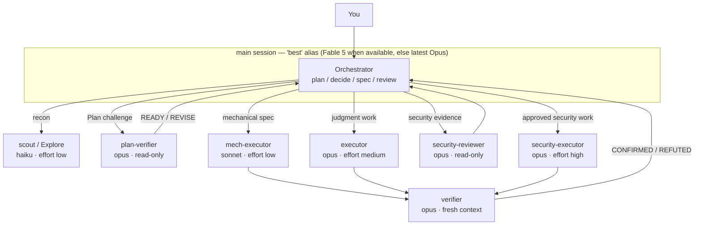

# pilotfish 🐟

> Pilot fish swim alongside the ocean's largest predators — small, fast, and doing the routine work so the big one doesn't have to.

**pilotfish** is a multi-model orchestration layer for [Claude Code](https://code.claude.com): the frontier model (Claude Fable 5 / Opus) plans, decides, and reviews in your main session, while cheaper models (Opus / Sonnet / Haiku) execute the volume work through global subagents. Quality is protected by fresh-context verification, not by using the biggest model everywhere. Everything installs globally — one setup, every project — and the whole stack degrades gracefully when the frontier model becomes unavailable.

> **Want OpenAI GPT-5.6 inside Claude Code without changing native Claude state?** [remora](https://github.com/Nanako0129/remora-cc) packages pilotfish's role-based orchestration pattern into a session-scoped launcher for an existing Anthropic-compatible gateway. Use pilotfish to study or customize the global policy; use remora for an approval-gated, verifiable install whose model and gateway overrides disappear with the child process.

**Where this came from:** my weekly quota reset one morning, and the first thing I did with a fresh Fable 5 allowance was ask it to figure out why the previous week's had evaporated. This repo is the setup that research produced, and it's what I now run daily on every project — three config files, no runtime code. The research notes (with sources) are in [docs/](./docs/).

[繁體中文說明](./README.zh-TW.md)

## Contents

- [Why](#why)
- [How it works](#how-it-works)
- [Install](#install)
- [Trust & security](#trust--security)
- [What gets installed](#what-gets-installed)
- [Updating](#updating)
- [The fallback story](#the-fallback-story)
- [Tuning & FAQ](#tuning--faq)
- [Research & design](#research--design)
- [Uninstall](#uninstall)
- [License](#license)

## Why

Frontier-model sessions are expensive in exactly the place it hurts subscribers: Claude Fable 5 consumes subscription limits **~2× faster than Opus** (official UI wording), and agentic sessions with heavy tool use burn far steeper than that in practice. Meanwhile, most tokens in a coding session are *not* judgment — they're searching, mechanical edits, test runs, and doc updates that a cheaper model does just as well.

Every piece of this now carries Anthropic backing. The [Fable 5 prompting guide](https://platform.claude.com/docs/en/build-with-claude/prompt-engineering/prompting-claude-fable-5) recommends frequent subagent delegation and notes that **independent fresh-context verifier subagents outperform self-critique**. And as of 2026-07-08, the cheap-executor split is officially benchmarked: Anthropic's own tests put a **Fable 5 orchestrator with Sonnet 5 workers at 96% of all-Fable performance for 46% of the cost** (BrowseComp: 86.8% vs 90.8% accuracy, $18.53 vs $40.56 per problem), with the inverse advisor pattern (Sonnet executor consulting Fable) at ~92% for ~63% on SWE-bench Pro — the orchestrator split pilotfish uses won on both axes ([multi-agent docs](https://platform.claude.com/docs/en/managed-agents/multi-agent)). A community experiment points the same direction at hobby scale — a delegation-heavy 12-worker audit ([Developers Digest](https://www.developersdigest.tech/blog/fable-5-orchestrator-model-playbook)), best-case-shaped, in API dollars:

| Setup (12-worker audit experiment, Developers Digest) | Cost | Savings |
|---|---|---|
| Everything on Fable 5 | $14.50 | — |
| Fable 5 orchestrates + Sonnet workers | $6.10 | 58% |
| Fable 5 orchestrates + Haiku workers | $3.70 | 74% |

Two subscription-specific bonuses stack on top:

> **Tip:** Claude subscriptions use a two-bucket weekly limit ([official article](https://support.claude.com/en/articles/14552983-models-usage-and-limits-in-claude-code)) — a shared "all models" bucket plus an **additional Sonnet-only bucket**. Routing execution to Sonnet subagents costs less per token *and* draws on that extra dedicated headroom. (Sonnet usage still counts against the all-models bucket too — it's additional allowance, not a fully separate pool.)

> ⚠️ **Warning:** Since Claude Code v2.1.198 the built-in `Explore` subagent inherits your main-session model. If your main session runs Fable 5 or Opus, every background search burns Opus-tier tokens (the Claude API caps Explore's inherited model at Opus; third-party platforms have no cap). pilotfish overrides it back to Haiku. (Trade-off, stated openly: a custom Explore loads your user memory like any subagent, which the built-in skips — the policy block self-disables for subagent roles to keep that overhead small.)

> **Note:** The two bullets above are subscription-plan mechanics. On the pay-per-token API the per-token savings still apply (there is no weekly bucket). On Bedrock / Vertex / Foundry, aliases resolve to each platform's built-in defaults and Fable 5 may not be enabled — pin versions with the `ANTHROPIC_DEFAULT_*_MODEL` env vars before relying on `best` there.

## How it works

Three layers, three files' worth of configuration, all under `~/.claude/`:

| Layer | File(s) | Job |
|---|---|---|
| Machine | `~/.claude/settings.json` | Who orchestrates (`best`) + automatic `fallbackModel` chain |
| Roles | `~/.claude/agents/*.md` | Eight role agents, each pinned to the right model tier and capability surface via frontmatter |
| Policy | `~/.claude/CLAUDE.md` | *How* to delegate — written in terms of roles, never model names |



The eight roles:

| Role | Model | Effort | Used for |
|---|---|---|---|
| `scout` | haiku | low | Read-only lookups: "where/how is X", symbol usages, config values |
| `Explore` | haiku | low | Overrides the built-in Explore agent (see warning above) |
| `plan-verifier` | opus | medium | Tool-enforced read-only Plan challenge before approval; returns READY/REVISE |
| `security-reviewer` | opus | high | Tool-enforced read-only security evidence and threat review before approval |
| `mech-executor` | sonnet | low | Fully-specified mechanical work: pattern refactors, convention tests, docs, bulk edits |
| `executor` | opus | medium | Implementation needing judgment: features, bug fixes, design-sensitive refactors |
| `verifier` | opus | medium | Fresh-context outcome verification after implementation; returns CONFIRMED/REFUTED and never fixes |
| `security-executor` | opus | high | Approved security implementation — deliberately kept off Fable 5, whose safety classifiers can refuse benign defensive-security work |

The policy layer now uses phase-specific dispatch brakes rather than requiring a finished implementation outcome before any delegation. Small, stable work stays direct. Large or ambiguous work may begin with bounded read-only discovery, then returns to the main session for one Plan; material Plans can receive a fresh readiness review and wait for user approval before writing agents start. Execution still requires stable scope, exclusive ownership, done criteria, integration, and verification. Every named role takes its model only from its agent definition, independent work runs in the background, and foreground agents remain reserved for immediate dependencies whose net benefit stays positive.

| Phase | pilotfish behavior |
|---|---|
| Discovery | `scout` / `Explore` collect bounded facts under a stable research contract; the implementation outcome may still be unknown |
| Plan | Main session reconciles evidence and owns scope, dependencies, ownership, budgets, stop conditions, and acceptance checks; `plan-verifier` may challenge it through read-only tools |
| Approval | Large, architectural, risky, or explicitly plan-first work waits for explicit approval before source writes or implementation briefs |
| Execution | `mech-executor`, `executor`, or `security-executor` receives one stable, exclusively owned contract |
| Verification | `verifier` attempts to refute completed non-trivial work through read-and-run tools; main session keeps final judgment |

Long-running processes remain main-session owned. Every Bash-capable leaf role (`mech-executor`, `executor`, `verifier`, `security-executor`) runs bounded commands in the foreground and never detaches with `nohup`, `setsid`, trailing `&`, or subagent-side background execution; if work cannot finish within 10 minutes, it returns the exact command, absolute worktree or working directory, required environment, and input paths to the orchestrator. The orchestrator runs it in that same context, never implicitly from the parent checkout. Any agent likely to run a long command must itself be spawned with `run_in_background: true`, preserving harness tracking and completion notification.

## Install

The recommended path is to clone the pinned v1.2.0 release locally, then start Claude Code from that checkout so it can read the runbook as a local file:

```sh
git clone --branch v1.2.0 --depth 1 https://github.com/Nanako0129/pilotfish.git
cd pilotfish
claude
```

In that Claude Code session, paste this prompt:

```text
Read the local file install/AGENT-INSTALL.md in the current checkout and follow it to install pilotfish into my global Claude Code configuration.
Show me the full plan of changes and get my approval before writing anything.
```

Claude reads the local install runbook, inspects your existing configuration, shows you a merge plan (nothing is overwritten blindly), and applies it after you approve. Installation is idempotent — running it again upgrades in place.

> **Runtime requirement:** Claude Code **2.1.207 or newer**. This is the verified baseline that enforces agent `tools` allowlists; pilotfish relies on that enforcement to keep `plan-verifier` and `security-reviewer` read-only before approval. The installer stops before making changes on an older or unidentifiable build. Earlier versions may also reject `best` or ignore `effort`. On native Windows without WSL, the runbook's shell snippets assume a POSIX shell; the installing agent is instructed to fall back to its own file tools. Restart your session afterwards: the agents directory is scanned at session start, and the `model` setting applies on restart.

For convenience, you can also paste the raw GitHub prompt below. This is a mutable, unpinned convenience path: it follows `main`, so the runbook and templates may change independently between review and installation, and Claude Code's WebFetch prompt-injection protection may intercept a remote document that directly instructs an AI to install software. If it is intercepted, use the local-checkout path above; do not disable or bypass the safety check.

```text
Read https://raw.githubusercontent.com/Nanako0129/pilotfish/main/install/AGENT-INSTALL.md
and follow it to install pilotfish into my global Claude Code configuration.
Show me the full plan of changes and get my approval before writing anything.
```

Prefer to do it by hand? The same steps are written for humans in [install/AGENT-INSTALL.md](./install/AGENT-INSTALL.md), and every file it installs lives under [templates/](./templates/).

## Trust & security

pilotfish installs by having Claude read a runbook and template files from this repo and merge them into your global `~/.claude/` config — including a policy block that then loads into **every future session**. Treat it like any `curl | sh`: trust flows from this repo and your GitHub connection, not from the paste. The local checkout path is recommended because you can inspect the pinned release before Claude reads the runbook. Before running it:

- **Read the actual bytes that get installed**, not just the runbook: the eight files in [templates/agents/](./templates/agents/) and [templates/claude-md.orchestration.md](./templates/claude-md.orchestration.md). Nothing else is written to disk.
- **Pin to a release tag or commit** so what you reviewed is what installs — `main` can change between the moment you read it and the moment Claude reads it. The recommended command above pins to the `v1.2.0` release tag; for the strictest guarantee, fetch and check out the full commit SHA you reviewed, then verify that checkout before launching Claude.
- **Keep the approval gate:** Claude writes nothing until you approve the merge plan, but the plan is still a summary of the runbook. Review the local runbook and templates yourself, and do not weaken or bypass WebFetch's prompt-injection protection if the raw URL is intercepted.

## What gets installed

| Target | Change | Reversible |
|---|---|---|
| `~/.claude/settings.json` | `model` → `"best"`, adds `fallbackModel: ["opus", "sonnet"]`, extends `availableModels` (only if you already restrict it) | Yes — keys are independent |
| `~/.claude/agents/` | Eight role agent files (listed above) | Yes — delete the files |
| `~/.claude/CLAUDE.md` | One `## Orchestration` section between `<!-- pilotfish:begin/end -->` markers | Yes — remove the marker block |

Nothing is written into any project. That's deliberate — see the design doc.

## Updating

The installer is idempotent, so **re-running the install prompt is the update** — unchanged files are skipped, the policy block is replaced in place, your settings are only touched if keys are missing. For a pinned update, first obtain the release tag you want to upgrade to, clone that tagged checkout locally, and start Claude Code from it:

```sh
git clone --branch <RELEASE_TAG> --depth 1 https://github.com/Nanako0129/pilotfish.git
cd pilotfish
claude
```

If you require a full commit SHA instead, fetch and check out that SHA before starting Claude Code.

Then paste:

```text
Read the local file install/AGENT-INSTALL.md in the current checkout and follow its "Updating an existing install" section: detect my installed pilotfish version, show me the changelog since then, and upgrade after my approval.
```

The raw `main` prompt in [Install](#install) remains a mutable convenience path, not a pinned or reliable update path; it may be intercepted by WebFetch prompt-injection protection, and it must not be used to bypass that protection.

| Want to… | How |
|---|---|
| Check what you have installed | `grep -o "pilotfish v[0-9.]*" ~/.claude/CLAUDE.md` — no output with markers present = pre-v1.1.0, update recommended |
| Get notified of new releases | GitHub → **Watch → Custom → Releases** on this repo |
| See what changed | [CHANGELOG.md](./CHANGELOG.md) — every release is also a git tag |
| Stay frozen on a reviewed version | Install pinned to a tag or SHA (see [Trust & security](#trust--security)); pinned installs never move until you re-pin |

## The fallback story

The whole stack keeps working when the frontier model disappears, because no policy text ever names a model:

| Failure mode | What catches it | Your action |
|---|---|---|
| Fable 5 leaves your plan (e.g. the July 2026 subscription changes) | `best` re-resolves to the latest Opus — the documented rule, and how the June 2026 outage actually behaved (notice banner, new sessions continued on Opus) | Likely none — the exact boundary UX is unpublished; worst case is one `/model` switch or enabling usage credits. Never pin `fable`/full IDs: pinned IDs hard-errored in June |
| Model overloaded / API errors | `fallbackModel: ["opus", "sonnet"]` switches automatically with a notice | None |
| A tier gets deprecated (Opus 4.8 → 4.9, Sonnet 5 → next) | Role agents use aliases (`opus`, `sonnet`, `haiku`) that track the recommended version | None |
| Frontier refuses a security task mid-run | Security work is pre-routed to `security-executor` (Opus), so it never reaches the classifier | None |

The delegation policy in `CLAUDE.md` speaks only of roles (`executor`, `scout`, …). Model bindings live in exactly one place — one line of frontmatter per agent file — so re-pointing a tier is a one-line edit that takes effect everywhere.

## Tuning & FAQ

| Question | Answer |
|---|---|
| I want to save even more quota | Switch the main session to `/model opusplan` — Opus thinks in plan mode, Sonnet executes. The role agents keep working unchanged underneath. |
| Can I force every subagent onto one model? | `CLAUDE_CODE_SUBAGENT_MODEL` overrides *all* per-agent frontmatter — that's why pilotfish doesn't set it. Leave it unset unless you want a temporary global override. |
| I use `availableModels` as an allowlist | Then it must contain every alias the agents use (`opus`, `sonnet`, `haiku`), or those agents silently fall back to inheriting the main-session model. The installer checks this. |
| Why `effort: low` on the cheap roles? | Effort is the second big quota lever. Fable-5-generation models at low effort routinely match previous-generation `xhigh`; recon and mechanical work don't need deep thinking. |
| Which effort for the main session? | `high`. Official guidance for Fable 5: `high` for most work, `xhigh` only for the longest-horizon tasks, `max` rarely — diminishing returns. |
| Do I lose the 1M context window? | No — Fable 5 is 1M by default, so `best` gives you 1M whenever it resolves to Fable 5. If you want *guaranteed* 1M even when `best` would fall back to Opus, set `model` to `"opus[1m]"` instead (the `[1m]` suffix is documented for `sonnet`/`opus`/`opusplan`/full IDs, not for `best`). |
| Does the orchestrator ever do work itself? | Yes — quick reads, small bounded repository scans, decisions, root-cause exploration, trace-driven debugging, tightly coupled state work, and anything you explicitly asked *it* to judge. Other work is delegated when its combined cost, context, latency, isolation, or verification benefit exceeds reconstruction and integration overhead. |
| My project has its own CLAUDE.md — conflict? | No file is ever touched: pilotfish writes only under `~/.claude/`. At runtime Claude Code *stacks* project memory and user memory — both load together, neither overrides the other. If one repo needs different behavior, add a local note there (e.g. "work inline in this repo, don't delegate") — the more specific instruction wins in practice. |
| I also installed a delegation-planning skill | Treat it as a complementary planning layer. A skill such as [Baton](https://github.com/cablate/baton) can shape discovery questions, worker count, ownership, sequence, and stop conditions; pilotfish supplies the named Claude roles, model routing, leaf-agent boundary, approval gate, and verifier contract. The [public two-turn compatibility gate](./benchmarks/baton-compatibility/README.md) completed Discovery → main-session Plan → `READY` → explicit approval → execution → fresh `CONFIRMED` verification. On its small fixture Baton correctly kept Discovery in the main session, then delegated the approved mechanical write to `mech-executor` and verification to `verifier`. pilotfish never disables user skills. |
| Subagent quality worries me | Independent fresh-context roles challenge both boundaries: read-only `plan-verifier` reviews a material Plan before approval, while outcome `verifier` tries to *refute* completed work after implementation. Official guidance: fresh-context verifiers beat self-critique. Escalation (two strikes → higher tier) handles the rest. Verification is not free—it re-reads context on Opus—so small work skips it. |
| Doesn't spawning agents cost extra? | Yes — every spawn is a fresh context that re-reads its slice of the codebase, and synthesis costs main-session tokens. A bounded task-local scan therefore stays inline by default. Discovery may still fan out when disjoint evidence materially reduces Plan uncertainty, while execution delegates only after its contract is stable. In the public mechanical control's execution-only segment, delegation reported 36.01% less cost with a 7.92% wall-time trade-off; neither compared run included the required outcome verifier, so this demonstrates route reachability rather than full-lifecycle savings. The research fixture shows the overhead of two scouts on one small task, not that plan-first discovery is categorically wrong. |
| Turn it off fast? | **This session:** tell Claude "don't delegate this session — work inline"; it's just policy text, it obeys immediately. **This repo:** add a local note to the repo's CLAUDE.md. **Whole machine:** comment out the `pilotfish:begin/end` block in `~/.claude/CLAUDE.md` — the agent files just sit unused. No reinstall needed to switch back. |
| Managed / enterprise machine? | Managed settings outrank user settings: a managed `model`, `availableModels` allowlist, or a managed agent with the same name will override pilotfish's user-level install. If roles don't take effect after restart, ask your admin — pilotfish can't (and shouldn't) override managed policy. |

## Research & design

This repo is the packaged result of a sourced research pass (official docs, Anthropic announcements, community measurements) plus a design rationale:

| Document | Language | Contents |
|---|---|---|
| [docs/research.md](./docs/research.md) | English | Full research findings: Fable 5 strengths & when it's wasteful, subscription economics, official Claude Code mechanisms, community measurements — with sources |
| [docs/research.zh-TW.md](./docs/research.zh-TW.md) | 繁體中文 | 研究報告原版（the original the English version translates） |
| [docs/design.md](./docs/design.md) | English | Why three layers, why role-based policy, why aliases over pinned IDs, effort tiering, what was deliberately left out |
| [benchmarks/dispatch-brake/README.md](./benchmarks/dispatch-brake/README.md) | English + data | Reproducible negative/positive controls, rejected policy iterations, Agent traces, cost and timing evidence |
| [benchmarks/dispatch-brake/positive-controls/README.md](./benchmarks/dispatch-brake/positive-controls/README.md) | English + data | Mechanical delegation evidence plus the measured task-local overhead and interpretation limits of small read-only fan-out |
| [benchmarks/baton-compatibility/README.md](./benchmarks/baton-compatibility/README.md) | English + data | Complete native-Claude two-turn Baton lifecycle, exact prompts, rejected harness run, routing evidence, and machine-readable results |

**Prior art & credits.** The "smart brain, cheap hands" split is not pilotfish's invention: Anthropic's own engineering writeup ([Decoupling the brain from the hands](https://www.anthropic.com/engineering/managed-agents)) frames it, Claude Code ships [`opusplan`](https://code.claude.com/docs/en/model-config) built in — if all you want is cheaper sessions, `/model opusplan` needs no repo at all — and [Rylaa/fable5-orchestrator](https://github.com/Rylaa/fable5-orchestrator) packages the same frugality thesis as a plugin with ledger-enforcing guard hooks. pilotfish's contribution is the packaging: eight deliberately-few roles instead of a 100-agent catalog, a role-based policy that survives model churn, an installer that shows its plan before touching anything, and claims that were adversarially fact-checked. If a heavier, hook-enforced flavor fits you better, use theirs.

## Uninstall

Tell Claude Code:

```text
Uninstall pilotfish: remove the eight pilotfish agent files from ~/.claude/agents/,
delete the <!-- pilotfish:begin --> ... <!-- pilotfish:end --> block from ~/.claude/CLAUDE.md,
and offer to restore my previous "model" / remove "fallbackModel" in ~/.claude/settings.json.
```

## License

[MIT](./LICENSE)
