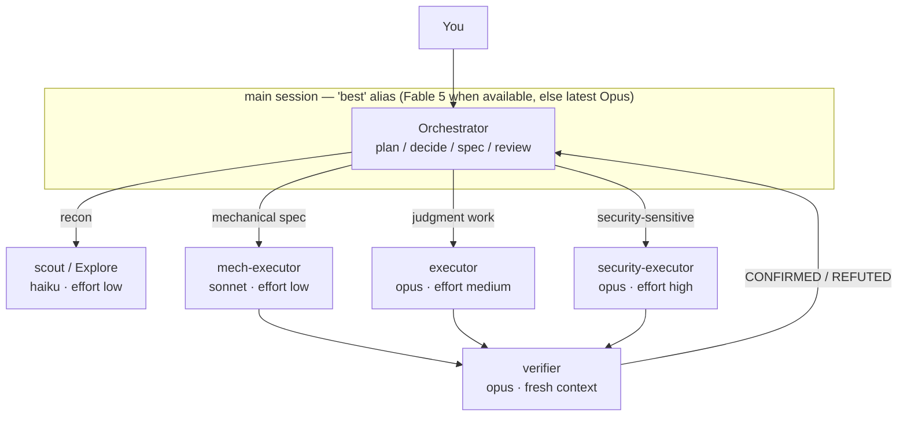

# pilotfish 🐟

> Pilot fish swim alongside the ocean's largest predators — small, fast, and doing the routine work so the big one doesn't have to.

**pilotfish** is a multi-model orchestration layer for [Claude Code](https://code.claude.com): the frontier model (Claude Fable 5 / Opus) plans, decides, and reviews in your main session, while cheaper models (Opus / Sonnet / Haiku) execute the volume work through global subagents. Quality is protected by fresh-context verification, not by using the biggest model everywhere. Everything installs globally — one setup, every project — and the whole stack degrades gracefully when the frontier model becomes unavailable.

[繁體中文說明](./README.zh-TW.md)

## Contents

- [Why](#why)
- [How it works](#how-it-works)
- [Install](#install)
- [What gets installed](#what-gets-installed)
- [The fallback story](#the-fallback-story)
- [Tuning & FAQ](#tuning--faq)
- [Research & design](#research--design)
- [Uninstall](#uninstall)
- [License](#license)

## Why

Frontier-model sessions are expensive in exactly the place it hurts subscribers: Claude Fable 5 consumes subscription limits **~2× faster than Opus** (official UI wording), and agentic sessions with heavy tool use burn far steeper than that in practice. Meanwhile, most tokens in a coding session are *not* judgment — they're searching, mechanical edits, test runs, and doc updates that a cheaper model does just as well.

The orchestrator/executor split is officially endorsed: Anthropic's Fable 5 prompting guide recommends frequent subagent delegation and notes that **independent fresh-context verifier subagents outperform self-critique**. The economics are measured, not hypothetical:

| Setup (12-worker audit experiment, Developers Digest) | Cost | Savings |
|---|---|---|
| Everything on Fable 5 | $14.50 | — |
| Fable 5 orchestrates + Sonnet workers | $6.10 | 58% |
| Fable 5 orchestrates + Haiku workers | $3.70 | 74% |

Two subscription-specific bonuses stack on top:

> **提示 / Tip:** Claude subscriptions use a two-bucket weekly limit — an "all models" bucket and a **separate Sonnet-only bucket**. Routing execution to Sonnet subagents doesn't just cost less per token; it shifts consumption into a different pool entirely.

> ⚠️ **Warning:** Since Claude Code v2.1.198 the built-in `Explore` subagent inherits your main-session model. If your main session runs Fable 5 or Opus, every background search burns frontier-priced tokens. pilotfish overrides it back to Haiku.

## How it works

Three layers, three files' worth of configuration, all under `~/.claude/`:

| Layer | File(s) | Job |
|---|---|---|
| Machine | `~/.claude/settings.json` | Who orchestrates (`best[1m]`) + automatic `fallbackModel` chain |
| Roles | `~/.claude/agents/*.md` | Six role agents, each pinned to the right model tier via one line of frontmatter |
| Policy | `~/.claude/CLAUDE.md` | *How* to delegate — written in terms of roles, never model names |



The six roles:

| Role | Model | Effort | Used for |
|---|---|---|---|
| `scout` | haiku | low | Read-only lookups: "where/how is X", symbol usages, config values |
| `Explore` | haiku | low | Overrides the built-in Explore agent (see warning above) |
| `mech-executor` | sonnet | low | Fully-specified mechanical work: pattern refactors, convention tests, docs, bulk edits |
| `executor` | opus | medium | Implementation needing judgment: features, bug fixes, design-sensitive refactors |
| `verifier` | opus | medium | Fresh-context adversarial verification; returns CONFIRMED/REFUTED, never fixes |
| `security-executor` | opus | high | Anything security-sensitive — deliberately kept off Fable 5, whose safety classifiers can refuse benign defensive-security work |

The policy layer adds the operating rules: spec delegations completely in one shot (including the *why*), start with the cheapest plausible role and escalate after two failures, always set an explicit `model` on ad-hoc fan-outs, and gate non-trivial work behind a `verifier` pass before calling it done.

## Install

Paste this single prompt into any Claude Code session:

```text
Read https://raw.githubusercontent.com/Nanako0129/pilotfish/main/install/AGENT-INSTALL.md
and follow it to install pilotfish into my global Claude Code configuration.
Show me the full plan of changes and get my approval before writing anything.
```

Claude reads the install runbook, inspects your existing configuration, shows you a merge plan (nothing is overwritten blindly), and applies it after you approve. Installation is idempotent — running it again upgrades in place.

> **注意 / Note:** Requires a reasonably current Claude Code (the `best` alias, `fallbackModel`, and subagent `model`/`effort` frontmatter shipped across 2026 releases). Restart your session afterwards: the agents directory is scanned at session start, and the `model` setting applies on restart.

Prefer to do it by hand? The same steps are written for humans in [install/AGENT-INSTALL.md](./install/AGENT-INSTALL.md), and every file it installs lives under [templates/](./templates/).

## What gets installed

| Target | Change | Reversible |
|---|---|---|
| `~/.claude/settings.json` | `model` → `"best[1m]"`, adds `fallbackModel: ["opus", "sonnet"]`, extends `availableModels` (only if you already restrict it) | Yes — keys are independent |
| `~/.claude/agents/` | Six role agent files (listed above) | Yes — delete the files |
| `~/.claude/CLAUDE.md` | One `## Orchestration` section between `<!-- pilotfish:begin/end -->` markers | Yes — remove the marker block |

Nothing is written into any project. That's deliberate — see the design doc.

## The fallback story

The whole stack keeps working when the frontier model disappears, because no policy text ever names a model:

| Failure mode | What catches it | Your action |
|---|---|---|
| Fable 5 leaves your plan (e.g. the July 2026 subscription changes) | `best` alias resolves to the latest Opus instead | None |
| Model overloaded / API errors | `fallbackModel: ["opus", "sonnet"]` switches automatically with a notice | None |
| A tier gets deprecated (Opus 4.8 → 4.9, Sonnet 5 → next) | Role agents use aliases (`opus`, `sonnet`, `haiku`) that track the recommended version | None |
| Frontier refuses a security task mid-run | Security work is pre-routed to `security-executor` (Opus), so it never reaches the classifier | None |

The delegation policy in `CLAUDE.md` speaks only of roles (`executor`, `scout`, …). Model bindings live in exactly one place — one line of frontmatter per agent file — so re-pointing a tier is a one-line edit that takes effect everywhere.

## Tuning & FAQ

| Question | Answer |
|---|---|
| I want to save even more quota | Switch the main session to `/model opusplan` — Opus thinks in plan mode, Sonnet executes. The role agents keep working unchanged underneath. |
| Can I force every subagent onto one model? | `CLAUDE_CODE_SUBAGENT_MODEL` overrides *all* per-agent frontmatter — that's why pilotfish doesn't set it. Leave it unset unless you want a temporary global override. |
| I use `availableModels` as an allowlist | Then it must contain every alias the agents use (`opus`, `sonnet`, `haiku`), or those agents silently fall back to inheriting the main-session model. The installer checks this. |
| Why `effort: low` on the cheap roles? | Effort is the second big quota lever. Fable-5-generation models at low effort routinely match previous-generation `xhigh`; recon and mechanical work don't need deep thinking. |
| Which effort for the main session? | `high`. Official guidance for Fable 5: `high` for most work, `xhigh` only for the longest-horizon tasks, `max` rarely — diminishing returns. |
| Does the orchestrator ever do work itself? | Yes — quick single-file reads, decisions, and anything you explicitly asked *it* to judge. Delegation has overhead; the policy says so. |
| Subagent quality worries me | That's what `verifier` is for: an independent fresh-context pass that tries to *refute* the work. Official guidance: fresh-context verifiers beat self-critique. Escalation (two strikes → higher tier) handles the rest. |

## Research & design

This repo is the packaged result of a sourced research pass (official docs, Anthropic announcements, community measurements) plus a design rationale:

| Document | Language | Contents |
|---|---|---|
| [docs/research.zh-TW.md](./docs/research.zh-TW.md) | 繁體中文 | Full research findings: Fable 5 strengths & when it's wasteful, subscription economics, official Claude Code mechanisms, community benchmarks — with sources |
| [docs/design.md](./docs/design.md) | English | Why three layers, why role-based policy, why aliases over pinned IDs, effort tiering, what was deliberately left out |

## Uninstall

Tell Claude Code:

```text
Uninstall pilotfish: remove the six pilotfish agent files from ~/.claude/agents/,
delete the <!-- pilotfish:begin --> ... <!-- pilotfish:end --> block from ~/.claude/CLAUDE.md,
and offer to restore my previous "model" / remove "fallbackModel" in ~/.claude/settings.json.
```

## License

[MIT](./LICENSE)
