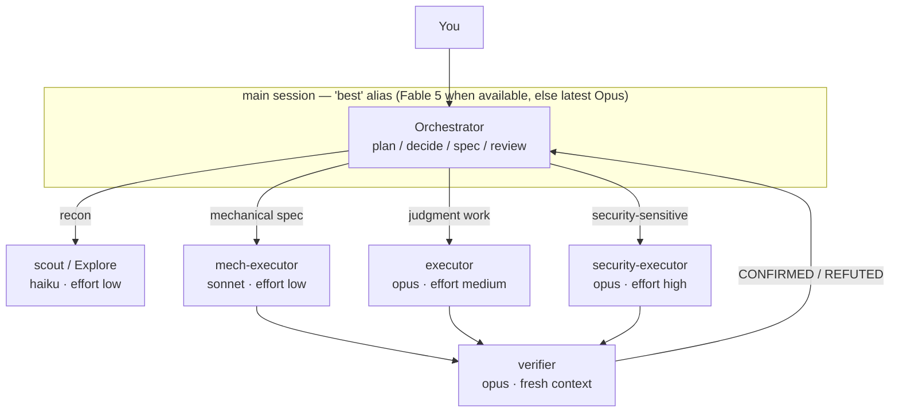

# pilotfish 🐟

> Pilot fish swim alongside the ocean's largest predators — small, fast, and doing the routine work so the big one doesn't have to.

**pilotfish** is a multi-model orchestration layer for [Claude Code](https://code.claude.com): the frontier model (Claude Fable 5 / Opus) plans, decides, and reviews in your main session, while cheaper models (Opus / Sonnet / Haiku) execute the volume work through global subagents. Quality is protected by fresh-context verification, not by using the biggest model everywhere. Everything installs globally — one setup, every project — and the whole stack degrades gracefully when the frontier model becomes unavailable.

**Where this came from:** my weekly quota reset one morning, and the first thing I did with a fresh Fable 5 allowance was ask it to figure out why the previous week's had evaporated. This repo is the setup that research produced, and it's what I now run daily on every project — three config files, no runtime code. The research notes (with sources) are in [docs/](./docs/).

[繁體中文說明](./README.zh-TW.md)

## Contents

- [Why](#why)
- [How it works](#how-it-works)
- [Install](#install)
- [Trust & security](#trust--security)
- [What gets installed](#what-gets-installed)
- [The fallback story](#the-fallback-story)
- [Tuning & FAQ](#tuning--faq)
- [Research & design](#research--design)
- [Uninstall](#uninstall)
- [License](#license)

## Why

Frontier-model sessions are expensive in exactly the place it hurts subscribers: Claude Fable 5 consumes subscription limits **~2× faster than Opus** (official UI wording), and agentic sessions with heavy tool use burn far steeper than that in practice. Meanwhile, most tokens in a coding session are *not* judgment — they're searching, mechanical edits, test runs, and doc updates that a cheaper model does just as well.

Two pieces of this come from Anthropic; the third is ours. Anthropic's [Fable 5 prompting guide](https://platform.claude.com/docs/en/build-with-claude/prompt-engineering/prompting-claude-fable-5) recommends frequent subagent delegation and notes that **independent fresh-context verifier subagents outperform self-critique**. Routing that delegated work to *cheaper* models to save quota is pilotfish's own design call, not an Anthropic recommendation. One community experiment puts dollars on it — a delegation-heavy 12-worker audit ([Developers Digest](https://www.developersdigest.tech/blog/fable-5-orchestrator-model-playbook)), close to this architecture's best case, so read it as an upper bound measured in API dollars rather than a typical subscription result:

| Setup (12-worker audit experiment, Developers Digest) | Cost | Savings |
|---|---|---|
| Everything on Fable 5 | $14.50 | — |
| Fable 5 orchestrates + Sonnet workers | $6.10 | 58% |
| Fable 5 orchestrates + Haiku workers | $3.70 | 74% |

Two subscription-specific bonuses stack on top:

> **Tip:** Claude subscriptions use a two-bucket weekly limit ([official article](https://support.claude.com/en/articles/14552983-models-usage-and-limits-in-claude-code)) — a shared "all models" bucket plus an **additional Sonnet-only bucket**. Routing execution to Sonnet subagents costs less per token *and* draws on that extra dedicated headroom. (Sonnet usage still counts against the all-models bucket too — it's additional allowance, not a fully separate pool.)

> ⚠️ **Warning:** Since Claude Code v2.1.198 the built-in `Explore` subagent inherits your main-session model. If your main session runs Fable 5 or Opus, every background search burns Opus-tier tokens (the Claude API caps Explore's inherited model at Opus; third-party platforms have no cap). pilotfish overrides it back to Haiku. (Trade-off, stated openly: a custom Explore loads your user memory like any subagent, which the built-in skips — the policy block self-disables for subagent roles to keep that overhead small.)

> **Note:** The two bullets above are subscription-plan mechanics. On the pay-per-token API the per-token savings still apply (there is no weekly bucket). On Bedrock / Vertex / Foundry, aliases resolve to each platform's built-in defaults and Fable 5 may not be enabled — pin versions with the `ANTHROPIC_DEFAULT_*_MODEL` env vars before relying on `best` there.

## How it works

Three layers, three files' worth of configuration, all under `~/.claude/`:

| Layer | File(s) | Job |
|---|---|---|
| Machine | `~/.claude/settings.json` | Who orchestrates (`best`) + automatic `fallbackModel` chain |
| Roles | `~/.claude/agents/*.md` | Six role agents, each pinned to the right model tier via one line of frontmatter |
| Policy | `~/.claude/CLAUDE.md` | *How* to delegate — written in terms of roles, never model names |



The six roles:

| Role | Model | Effort | Used for |
|---|---|---|---|
| `scout` | haiku | low | Read-only lookups: "where/how is X", symbol usages, config values |
| `Explore` | haiku | low | Overrides the built-in Explore agent (see warning above) |
| `mech-executor` | sonnet | low | Fully-specified mechanical work: pattern refactors, convention tests, docs, bulk edits |
| `executor` | opus | medium | Implementation needing judgment: features, bug fixes, design-sensitive refactors |
| `verifier` | opus | medium | Fresh-context adversarial verification; returns CONFIRMED/REFUTED, never fixes |
| `security-executor` | opus | high | Anything security-sensitive — deliberately kept off Fable 5, whose safety classifiers can refuse benign defensive-security work |

The policy layer adds the operating rules: spec delegations completely in one shot (including the *why*), start with the cheapest plausible role and escalate after two failures, always set an explicit `model` on ad-hoc fan-outs, and gate non-trivial work behind a `verifier` pass before calling it done.

## Install

Paste this single prompt into any Claude Code session:

```text
Read https://raw.githubusercontent.com/Nanako0129/pilotfish/main/install/AGENT-INSTALL.md
and follow it to install pilotfish into my global Claude Code configuration.
Show me the full plan of changes and get my approval before writing anything.
```

Claude reads the install runbook, inspects your existing configuration, shows you a merge plan (nothing is overwritten blindly), and applies it after you approve. Installation is idempotent — running it again upgrades in place.

> **Note:** Requires a reasonably current Claude Code — on older builds the `best` alias may be rejected, and `effort`/`tools` frontmatter is silently ignored (agents still run, just untuned). On native Windows without WSL, the runbook's shell snippets assume a POSIX shell; the installing agent is instructed to fall back to its own file tools. Restart your session afterwards: the agents directory is scanned at session start, and the `model` setting applies on restart.

Prefer to do it by hand? The same steps are written for humans in [install/AGENT-INSTALL.md](./install/AGENT-INSTALL.md), and every file it installs lives under [templates/](./templates/).

## Trust & security

pilotfish installs by having Claude fetch a runbook and template files from this repo and merge them into your global `~/.claude/` config — including a policy block that then loads into **every future session**. Treat it like any `curl | sh`: trust flows from this repo and your GitHub connection, not from the paste. Before running it:

- **Read the actual bytes that get installed**, not just the runbook: the six files in [templates/agents/](./templates/agents/) and [templates/claude-md.orchestration.md](./templates/claude-md.orchestration.md). Nothing else is written to disk.
- **Pin to a commit** so what you reviewed is what installs — `main` can change between the moment you read it and the moment Claude fetches it. Replace `main` with a full commit SHA (from the [commits page](https://github.com/Nanako0129/pilotfish/commits/main)):

```text
Read https://raw.githubusercontent.com/Nanako0129/pilotfish/<COMMIT_SHA>/install/AGENT-INSTALL.md
and follow it to install pilotfish. Fetch every template from that same <COMMIT_SHA>, never from main.
Show me the full plan of changes and get my approval before writing anything.
```

- **The approval gate is necessary but not sufficient by itself:** Claude writes nothing until you approve, but the plan it shows you is its own summary of a document it just fetched. Pinning plus reading the templates is what makes the gate trustworthy. If you don't trust remote fetching at all, clone the repo and point the install prompt at your local checkout.

## What gets installed

| Target | Change | Reversible |
|---|---|---|
| `~/.claude/settings.json` | `model` → `"best"`, adds `fallbackModel: ["opus", "sonnet"]`, extends `availableModels` (only if you already restrict it) | Yes — keys are independent |
| `~/.claude/agents/` | Six role agent files (listed above) | Yes — delete the files |
| `~/.claude/CLAUDE.md` | One `## Orchestration` section between `<!-- pilotfish:begin/end -->` markers | Yes — remove the marker block |

Nothing is written into any project. That's deliberate — see the design doc.

## The fallback story

The whole stack keeps working when the frontier model disappears, because no policy text ever names a model:

| Failure mode | What catches it | Your action |
|---|---|---|
| Fable 5 leaves your plan (e.g. the July 2026 subscription changes) | `best` re-resolves to the latest Opus — the documented rule, and how the June 2026 outage actually behaved (notice banner, new sessions continued on Opus) | Likely none — the exact boundary UX is unpublished; worst case is one `/model` switch or enabling usage credits. Never pin `fable`/full IDs: pinned IDs hard-errored in June |
| Model overloaded / API errors | `fallbackModel: ["opus", "sonnet"]` switches automatically with a notice | None |
| A tier gets deprecated (Opus 4.8 → 4.9, Sonnet 5 → next) | Role agents use aliases (`opus`, `sonnet`, `haiku`) that track the recommended version | None |
| Frontier refuses a security task mid-run | Security work is pre-routed to `security-executor` (Opus), so it never reaches the classifier | None |

The delegation policy in `CLAUDE.md` speaks only of roles (`executor`, `scout`, …). Model bindings live in exactly one place — one line of frontmatter per agent file — so re-pointing a tier is a one-line edit that takes effect everywhere.

## Tuning & FAQ

| Question | Answer |
|---|---|
| I want to save even more quota | Switch the main session to `/model opusplan` — Opus thinks in plan mode, Sonnet executes. The role agents keep working unchanged underneath. |
| Can I force every subagent onto one model? | `CLAUDE_CODE_SUBAGENT_MODEL` overrides *all* per-agent frontmatter — that's why pilotfish doesn't set it. Leave it unset unless you want a temporary global override. |
| I use `availableModels` as an allowlist | Then it must contain every alias the agents use (`opus`, `sonnet`, `haiku`), or those agents silently fall back to inheriting the main-session model. The installer checks this. |
| Why `effort: low` on the cheap roles? | Effort is the second big quota lever. Fable-5-generation models at low effort routinely match previous-generation `xhigh`; recon and mechanical work don't need deep thinking. |
| Which effort for the main session? | `high`. Official guidance for Fable 5: `high` for most work, `xhigh` only for the longest-horizon tasks, `max` rarely — diminishing returns. |
| Do I lose the 1M context window? | No — Fable 5 is 1M by default, so `best` gives you 1M whenever it resolves to Fable 5. If you want *guaranteed* 1M even when `best` would fall back to Opus, set `model` to `"opus[1m]"` instead (the `[1m]` suffix is documented for `sonnet`/`opus`/`opusplan`/full IDs, not for `best`). |
| Does the orchestrator ever do work itself? | Yes — quick single-file reads, decisions, and anything you explicitly asked *it* to judge. Delegation has overhead; the policy says so. |
| My project has its own CLAUDE.md — conflict? | No file is ever touched: pilotfish writes only under `~/.claude/`. At runtime Claude Code *stacks* project memory and user memory — both load together, neither overrides the other. If one repo needs different behavior, add a local note there (e.g. "work inline in this repo, don't delegate") — the more specific instruction wins in practice. |
| Subagent quality worries me | That's what `verifier` is for: an independent fresh-context pass that tries to *refute* the work. Official guidance: fresh-context verifiers beat self-critique. Escalation (two strikes → higher tier) handles the rest. Note verification isn't free either — it re-reads context on Opus — which is why the policy scopes it to non-trivial work only. |
| Doesn't spawning agents cost extra? | Yes — every spawn is a fresh context that re-reads its slice of the codebase, and spec-writing costs main-session tokens. That overhead is why the policy says don't delegate single-file reads or quick judgments. The savings come from volume work (search, bulk edits, test runs), where the cheaper tier's per-token price dwarfs the spawn overhead. |
| Turn it off fast? | **This session:** tell Claude "don't delegate this session — work inline"; it's just policy text, it obeys immediately. **This repo:** add a local note to the repo's CLAUDE.md. **Whole machine:** comment out the `pilotfish:begin/end` block in `~/.claude/CLAUDE.md` — the agent files just sit unused. No reinstall needed to switch back. |
| Managed / enterprise machine? | Managed settings outrank user settings: a managed `model`, `availableModels` allowlist, or a managed agent with the same name will override pilotfish's user-level install. If roles don't take effect after restart, ask your admin — pilotfish can't (and shouldn't) override managed policy. |

## Research & design

This repo is the packaged result of a sourced research pass (official docs, Anthropic announcements, community measurements) plus a design rationale:

| Document | Language | Contents |
|---|---|---|
| [docs/research.zh-TW.md](./docs/research.zh-TW.md) | 繁體中文 | Full research findings: Fable 5 strengths & when it's wasteful, subscription economics, official Claude Code mechanisms, community benchmarks — with sources |
| [docs/design.md](./docs/design.md) | English | Why three layers, why role-based policy, why aliases over pinned IDs, effort tiering, what was deliberately left out |

## Uninstall

Tell Claude Code:

```text
Uninstall pilotfish: remove the six pilotfish agent files from ~/.claude/agents/,
delete the <!-- pilotfish:begin --> ... <!-- pilotfish:end --> block from ~/.claude/CLAUDE.md,
and offer to restore my previous "model" / remove "fallbackModel" in ~/.claude/settings.json.
```

## License

[MIT](./LICENSE)
