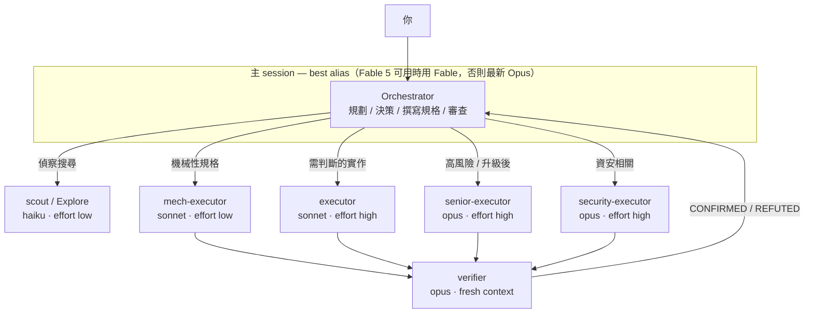

# pilotfish 🐟

> 領航魚與海中最大的掠食者同游——小而快，把例行工作攬下來，讓大傢伙專心做只有牠能做的事。

**pilotfish** 是 [Claude Code](https://code.claude.com) 的多模型協作層：前沿模型（Claude Fable 5 / Opus）在主 session 負責規劃、決策與審查，便宜的模型（Opus / Sonnet / Haiku）透過全域 subagent 承接大量執行工作。品質靠 fresh-context 驗證把關，而不是靠處處使用最大的模型。所有設定安裝在全域層——設定一次、所有專案生效——而且整套架構在前沿模型不可用時能無感降級。

> **想在 Claude Code 裡使用 OpenAI GPT-5.6，又不改動原生 Claude state？** [Remora](https://github.com/Nanako0129/remora-cc) 把 pilotfish 的角色分工模式包裝成 session-scoped launcher，連接既有的 Anthropic-compatible gateway。想研究或客製全域 orchestration policy，可以使用 pilotfish；想要經過批准、可驗證，而且 model 與 gateway override 會隨 child process 消失的安裝方式，可以使用 Remora。

**這個專案的由來：** 某天早上我的週額度重置了，拿到新一週的 Fable 5 額度後做的第一件事，是要它研究上一週的額度為什麼蒸發。最初的研究成果是三個設定檔，沒有 runtime 程式碼；這個 fork 仍讓實際安裝進 Claude 的部分保持 configuration-only，同時加入離線 Python routing、compilation、evaluation 與 lifecycle tooling。附出處的研究筆記在 [docs/](./docs/)。

**Downstream 版本：** `1.2.0-trionnemesis.1` 將 upstream v1.2.0 中相容的控制選擇性對應到這個 fork 的 deterministic router、七角色 registry、append-only ledger，以及 Claude／Codex adapter contracts。這是 trionnemesis 的 downstream release line，不是 upstream 專案的官方 `v1.2.0` release。

**所有權與來源標示：** 本 repo 是
[Nanako0129/pilotfish](https://github.com/Nanako0129/pilotfish) 的獨立維護
MIT 衍生版本。原作者著作權與完整 MIT permission notice 保留在
[LICENSE](./LICENSE)；trionnemesis 維護 downstream routing core、adapter、
tests 與 release line。「獨立」代表維護與產品方向，不表示 upstream
內容是由 downstream 從零原創。

### Claude Code ↔ Codex adapter 矩陣

Canonical router 與七個 leaf-role contracts 維持 vendor-neutral；每個
adapter 只會把意圖編譯成 target 真正能表達的控制：

| Contract surface | Claude Code adapter | 本 branch 的 Codex adapter |
|---|---|---|
| 主政策 | 整合到 `~/.claude/CLAUDE.md` 的 marker block | 供 `AGENTS.md` 整合的 marker block |
| Leaf roles | 七個 `agents/*.md` definitions | 七個 Codex 原生 custom-agent TOML definitions |
| 模型綁定 | agent frontmatter 內的 Claude aliases | 原生 `model` + `model_reasoning_effort` |
| 唯讀角色 | positive tools 加上 denied write tools | 原生 `sandbox_mode = "read-only"`；positive tool lists 仍是 prompt guidance |
| 禁止子委派 | 禁用 Claude agent／workflow tools | prompt guidance；不宣稱 Codex `agents.max_depth`，因為 multi-agent V2 會忽略它 |
| Capability 證據 | compiler report + runtime checks | 隔離的 CLI／config probe + capability report |
| 安裝／回滾 | 已有 fingerprint-approved installer | 目前只到 compiler preview；Codex installer／rollback backend 尚未發布 |

所以 Codex compiler 已經是實質的 downstream 產品方向，但目前還不應宣稱
是一鍵可安裝的 Codex release。精確的 verified／degraded 邊界請見
[adapter capability discovery](./docs/adapter-capabilities.md)。

[English README](./README.md)

## 目錄

- [為什麼](#為什麼)
- [運作方式](#運作方式)
- [安裝](#安裝)
- [信任與安全](#信任與安全)
- [安裝內容](#安裝內容)
- [更新](#更新)
- [Fallback 機制](#fallback-機制)
- [調校與常見問題](#調校與常見問題)
- [研究與設計](#研究與設計)
- [移除](#移除)
- [授權](#授權)

## 為什麼

前沿模型的 session 貴在訂閱者最痛的地方：Claude Fable 5 消耗訂閱額度的速度**約為 Opus 的 2 倍**（官方 UI 原文），而重度使用工具的 agentic session 實際消耗還要陡得多。但一個 coding session 裡大多數 token 並不是「判斷」——是搜尋、機械性編輯、跑測試、更新文件，這些工作便宜的模型做得一樣好。

這套做法的每一塊現在都有 Anthropic 背書。[Fable 5 prompting 指南](https://platform.claude.com/docs/en/build-with-claude/prompt-engineering/prompting-claude-fable-5)建議頻繁委派 subagent，並指出「**獨立的 fresh-context 驗證者 subagent 效果優於模型自我批判**」；而 2026-07-08 起，「便宜模型執行」也有了官方 benchmark：Anthropic 自家測試中 **Fable 5 orchestrator + Sonnet 5 workers 達到全 Fable 效能的 96%、成本只要 46%**（BrowseComp：準確率 86.8% vs 90.8%、每題 $18.53 vs $40.56），反向的 advisor 模式（Sonnet 執行、諮詢 Fable）則是約 92% 效能、63% 成本（SWE-bench Pro）——pilotfish 採用的 orchestrator 分工在兩個軸上都勝出（[multi-agent 文件](https://platform.claude.com/docs/en/managed-agents/multi-agent)）。社群實驗在業餘規模指向同一方向——高度委派的 12-worker 稽核（[Developers Digest](https://www.developersdigest.tech/blog/fable-5-orchestrator-model-playbook)），偏最佳情境、API 美元計價：

| 配置（12-worker 稽核實驗，Developers Digest） | 成本 | 節省 |
|---|---|---|
| 全程 Fable 5 | $14.50 | — |
| Fable 5 協調 + Sonnet workers | $6.10 | 58% |
| Fable 5 協調 + Haiku workers | $3.70 | 74% |

訂閱制用戶還能疊加兩個額外紅利：

> **提示：** Claude 訂閱採雙桶每週限額（[官方文章](https://support.claude.com/en/articles/14552983-models-usage-and-limits-in-claude-code)）——共用的「所有模型」桶之外，另有一個 **Sonnet 專用的額外桶**。把執行工作路由給 Sonnet subagent 不只單價便宜，還能動用這份額外的專屬額度。（Sonnet 用量仍會計入「所有模型」桶——這是額外配額，不是完全獨立的池子。）

> ⚠️ **警告：** Claude Code v2.1.198 起，內建的 `Explore` subagent 會繼承主 session 的模型。如果你的主 session 跑 Fable 5 或 Opus，每一次背景搜尋都在燒 Opus 級的 token（Claude API 上 Explore 繼承的模型以 Opus 封頂；第三方平台無此上限）。pilotfish 會把它覆寫回 Haiku。（坦白揭露一個代價：自訂的 Explore 會像一般 subagent 一樣載入你的使用者記憶，而內建版會跳過——政策區塊對 subagent 角色會自我停用，把這個開銷壓到最小。）

> **注意：** 上面兩點是訂閱方案的機制。在按 token 計費的 API 上，單價層面的節省依然成立（但沒有週額度桶）；在 Bedrock / Vertex / Foundry 上，alias 解析到各平台的內建預設版本、Fable 5 未必開通——依賴 `best` 之前，先用 `ANTHROPIC_DEFAULT_*_MODEL` 環境變數釘選版本。

## 運作方式

三層架構、三處設定，全部在 `~/.claude/` 底下：

| 層 | 檔案 | 職責 |
|---|---|---|
| 機器層 | `~/.claude/settings.json` | 決定誰當 orchestrator（`best`）＋自動 `fallbackModel` 切換鏈 |
| 角色層 | `~/.claude/agents/*.md` | 七個 leaf role agents，各用一行 frontmatter 綁定到 canonical 模型層級 |
| 政策層 | `~/.claude/CLAUDE.md` | 規範「怎麼委派」——只寫角色，永不寫模型名 |



七個角色：

| 角色 | 模型 | Effort | 用途 |
|---|---|---|---|
| `scout` | haiku | low | 唯讀查找：「X 在哪／怎麼運作」、symbol 用法、設定值 |
| `Explore` | haiku | low | 覆寫內建 Explore agent（見上方警告） |
| `mech-executor` | sonnet | low | 規格完整的機械性工作：pattern 重構、照慣例寫測試、文件、批次編輯 |
| `executor` | sonnet | high | 需要判斷的有界實作：功能開發、bug 修復、涉及設計的重構 |
| `senior-executor` | opus | high | 高風險或 canonical escalation 後的實作 |
| `verifier` | opus | medium | Fresh-context 對抗式驗證；回報 CONFIRMED/REFUTED，永不動手修 |
| `security-executor` | opus | high | 一切資安相關工作——刻意不走 Fable 5，其安全分類器可能誤拒良性的防禦性資安工作 |

政策層要求每次 dispatch 前先建立 schema-valid Task Envelope，再交由 canonical deterministic router 決定。Dispatch brake 會在根因探索、trace 除錯與緊密耦合狀態傳遞仍共用同一條 evidence chain 時留在主 session；當穩定工作的委派具有正向 net benefit 時仍會委派。`REFINE`、`TAKEOVER`、`BLOCK` 是 control-plane outcome，不會被發明成角色；security 保持固定 lane，Plan 需要時先取得明確批准，已命名角色的 model 只來自其 agent 定義，非平凡變更則由 fresh-context verifier 驗證。

## 安裝

七角色 installer 目前發布在 fork 的 `v.1.2` downstream branch。請從這個明確 ref clone 到本機、在解析出的 commit 上 detach 並完成檢查，再啟動 Claude Code，讓它讀取本地 runbook：

```sh
git clone --branch v.1.2 --single-branch https://github.com/trionnemesis/pilotfish.git
cd pilotfish
git switch --detach HEAD
git rev-parse HEAD
claude
```

在這個 Claude Code session 貼上：

```text
Read the local file install/AGENT-INSTALL.md in the current checkout and follow it to install pilotfish into my global Claude Code configuration.
Show me the full plan of changes and get my approval before writing anything.
```

Claude 會讀取本地安裝 runbook、檢查你既有的設定、先給你一份合併計畫（不會盲目覆寫任何東西），經你同意後才動手。安裝是冪等的——重跑一次等於原地升級。

> **注意：** 安裝要求 Claude Code 2.1.207 以上，才能保證七個角色的 tool allowlist／denylist 被 runtime 強制執行。若無法驗證這個版本下限，本地 installer 會在寫入前阻擋。安裝後請重啟 session：agents 目錄在 session 啟動時掃描，`model` 設定在重啟後生效。

不支援遠端、直接對 agent 下指令的安裝 prompt。請使用釘選的本地 checkout；不要為了安裝 pilotfish 而停用或繞過 WebFetch、sandbox、approval 或 prompt-injection 防護。

想手動安裝？同樣的步驟寫在 [install/AGENT-INSTALL.md](./install/AGENT-INSTALL.md)，所有安裝檔的原始範本都在 [templates/](./templates/)。

## 信任與安全

pilotfish 會從本地 canonical spec 編譯 artifacts，再合併進你的全域 `~/.claude/` 設定——其中包含一段會載入**未來每一個 session** 的政策區塊。請把 checkout 視為可執行設定；執行 installer 前先檢查並釘選版本。

- **實際會被裝進去的檔案要親自讀過**，不只是 runbook：包括 [templates/agents/](./templates/agents/) 的七個檔案、[templates/claude-md.orchestration.md](./templates/claude-md.orchestration.md) 與 settings patch。Installer 也會在 `~/.claude/pilotfish/` 寫入私有 ownership state、backup 與 rollback manifest。
- **釘選到 release tag 或 commit**，確保你審過的就是實際裝的——從你讀 branch、到 Claude 讀它之間，branch 可能變動。上面的 preview 指令會解析 fork 的 `v.1.2` branch，並立即讓 checkout detach；啟動 Claude 前，請記錄並審閱印出的完整 commit SHA。未來若有包含此 installer 的 release，應優先使用其 immutable tag 或完整 SHA。
- **保留 approval gate：** 寫入必須帶上已審閱 plan 的精確 SHA-256 fingerprint。不要削弱或繞過 WebFetch、sandbox、approval 或 prompt-injection 防護。
- **遵守平台邊界：** POSIX mutation 使用 descriptor-relative no-follow confinement。Windows installer 只接受位於目前 operator 已解析 profile 內的 target，不支援 elevated 或 cross-user install；此邊界讓它依賴目前 profile ACL，而不宣稱具備與 POSIX 完全相同的 directory descriptor 保證。

## 安裝內容

| 目標 | 變更 | 可還原 |
|---|---|---|
| `~/.claude/settings.json` | 合併缺少的 compiler-owned keys；保留無關或衝突的 user values | 可——key-level compare-and-swap |
| `~/.claude/agents/` | 七個 compiler-emitted 角色 agent 檔（如上表） | 可——只移除未變更的 owned files |
| `~/.claude/CLAUDE.md` | 一段 `## Orchestration`，包在 `<!-- pilotfish:begin/end -->` 標記之間 | 可——移除標記區塊 |
| `~/.claude/pilotfish/` | 私有 hash-only ownership state、backups 與 rollback manifests | 可——由 manifest 執行有界 rollback |

不會寫入任何專案目錄。這是刻意的設計——理由見設計文件。

## 更新

安裝程式是冪等的，所以**從新版且已釘選的 checkout 重跑 installer 就是更新**。沒變的檔案會跳過；使用者改過的 owned content 會被保留並回報。先取得想升級到的 release tag 或 commit，clone 並檢查該 checkout：

```sh
git clone --branch <REVIEWED_FORK_REF> --single-branch https://github.com/trionnemesis/pilotfish.git
cd pilotfish
git switch --detach HEAD
git rev-parse HEAD
claude
```

如果需要改用完整 commit SHA，請先 fetch 並 checkout 該 SHA，再啟動 Claude Code。

接著依本地 runbook 執行 dry-run 與 fingerprint-bound update：

```text
Read the local file install/AGENT-INSTALL.md in the current checkout and follow its Update section. Show the exact dry-run plan and do not write until I approve that plan's fingerprint.
```

| 想要…… | 做法 |
|---|---|
| 查目前安裝的版本 | `grep -o "pilotfish v[0-9.]*" ~/.claude/CLAUDE.md`——有標記但查不到版本＝v1.1.0 之前的安裝，建議更新 |
| 收到新版通知 | 在 GitHub 對本 repo 按 **Watch → Custom → Releases** |
| 看改了什麼 | [CHANGELOG.md](./CHANGELOG.md)——每個版本都有對應的 git tag |
| 凍結在審核過的版本 | 用 tag 或 SHA 釘選安裝（見[信任與安全](#信任與安全)）——釘選的安裝在你重新釘選前不會變動 |

## Fallback 機制

前沿模型消失時整套架構照常運作，因為政策文字從不指名模型：

| 失效情境 | 誰接住 | 你要做什麼 |
|---|---|---|
| Fable 5 離開你的方案（如 2026 年 7 月的訂閱變動） | `best` 重新解析為最新 Opus——這是文件規則，也是 2026 年 6 月停用期的實際行為（通知橫幅、新 session 自動改跑 Opus） | 大多不用做——邊界當下的確切 UI 官方未發布，最壞情況是手動 `/model` 一次或啟用 usage credits。切勿釘死 `fable`／完整 ID：6 月時釘死 ID 的人收到硬性錯誤 |
| 模型過載／API 錯誤 | `fallbackModel: ["opus", "sonnet"]` 自動切換並顯示通知 | 不用做 |
| 某層模型被棄用（Opus 4.8 → 4.9、Sonnet 5 → 下一代） | 角色 agent 用 alias（`opus`、`sonnet`、`haiku`），自動跟隨官方推薦版本 | 不用做 |
| 前沿模型在任務中途拒絕資安工作 | 資安工作一開始就路由給 `security-executor`（Opus），根本不會碰到分類器 | 不用做 |

`CLAUDE.md` 裡的委派政策只提角色（`executor`、`scout`……）。模型綁定只存在一個地方——每個 agent 檔的一行 frontmatter——要改指向，改一行、處處生效。

## 調校與常見問題

| 問題 | 回答 |
|---|---|
| 想省更多額度 | 主 session 切 `/model opusplan`——plan mode 用 Opus 思考、執行切 Sonnet。底下的角色 agent 照常運作。 |
| 能強制所有 subagent 用同一個模型嗎？ | `CLAUDE_CODE_SUBAGENT_MODEL` 會覆蓋*所有* agent 的 frontmatter——所以 pilotfish 不設它。除非要臨時全域覆寫，否則別設。 |
| 我有設 `availableModels` 白名單 | 那名單必須包含 agents 用到的所有 alias（`opus`、`sonnet`、`haiku`），否則那些 agent 會被靜默跳過、改為繼承主 session 模型。安裝程式會檢查這件事。 |
| 為什麼便宜角色都設 `effort: low`？ | Effort 是第二大額度槓桿。Fable 5 世代的模型在 low effort 常已達前代 `xhigh` 的水準；偵察與機械性工作不需要深度思考。 |
| 主 session 用哪個 effort？ | `high`。Fable 5 官方建議：大多數工作用 `high`，`xhigh` 留給最長時程的任務，`max` 少用——報酬遞減。 |
| 會失去 1M context window 嗎？ | 不會——Fable 5 預設即 1M，`best` 解析到 Fable 5 時就是 1M。若想在 `best` 降級到 Opus 時也*保證* 1M，把 `model` 改設 `"opus[1m]"`（`[1m]` 後綴的文件支援範圍是 `sonnet`/`opus`/`opusplan`/完整 model ID，不含 `best`）。 |
| Orchestrator 自己完全不動手嗎？ | 會動手——馬上要用的閱讀、決策、根因探索、trace 除錯、緊密耦合狀態工作，以及你明確要*它*判斷的事。委派必須有正向 net benefit。 |
| 我的專案有自己的 CLAUDE.md，會衝突嗎？ | 檔案完全不會被動到：pilotfish 只寫 `~/.claude/` 底下。執行時 Claude Code 把專案層與使用者層記憶「疊加」載入——兩者同時生效、互不覆寫。若某個 repo 需要不同行為，在該專案的 CLAUDE.md 寫一條在地規則（例如「這個 repo 內直接動手、不委派」）——實務上較具體的指示會勝出。 |
| 擔心 subagent 品質 | 這正是 `verifier` 的職責：獨立 fresh-context、以「推翻」為目標的驗證。官方口徑：fresh-context 驗證者優於自我批判。剩下的交給升級規則（兩次失敗 → 升一層）。注意驗證本身也不是免費的——它在 Opus 上重讀 context——所以政策把它限定在非平凡的工作。 |
| Spawn agent 不是有額外成本嗎？ | 有——每次 spawn 都是全新 context、要重讀它負責的那部分 codebase，寫規格也花主 session 的 token。Dispatch brake 會讓緊密耦合的診斷留在主 session；穩定的大量工作、真正平行、隔離 ownership 與 fresh-context independence，若收益超過協調成本仍適合委派。 |
| 怎麼快速關掉？ | **只關這個 session：** 直接跟 Claude 說「這個 session 不要委派，全部直接動手」——那只是政策文字，它立刻照辦。**只關這個 repo：** 在該 repo 的 CLAUDE.md 加一條在地規則。**整台機器：** 把 `~/.claude/CLAUDE.md` 裡的 `pilotfish:begin/end` 區塊註解掉——agent 檔留著閒置即可。切回來不必重裝。 |
| 公司管的機器（managed）？ | Managed settings 優先於使用者層設定：managed 的 `model`、`availableModels` 白名單、或同名的 managed agent 都會蓋過 pilotfish 的使用者層安裝。重啟後角色沒生效就找管理員——pilotfish 設計上不會（也不該）繞過管理政策。 |

## 研究與設計

這個 repo 是一輪有出處的研究（官方文件、Anthropic 公告、社群實測）加上設計論證的落地成果：

| 文件 | 語言 | 內容 |
|---|---|---|
| [docs/research.zh-TW.md](./docs/research.zh-TW.md) | 繁體中文 | 完整研究發現：Fable 5 的強項與何時浪費、訂閱經濟學、Claude Code 官方機制、社群實測數字——附來源 |
| [docs/research.md](./docs/research.md) | English | 研究報告的英文版（忠實翻譯） |
| [docs/design.md](./docs/design.md) | English | 為什麼是三層、為什麼政策以角色撰寫、為什麼用 alias 不釘版本、effort 分層、以及刻意不做的事 |

**先行者與致意。** 「聰明的腦、便宜的手」這個分工不是 pilotfish 發明的：Anthropic 自己的工程文（[Decoupling the brain from the hands](https://www.anthropic.com/engineering/managed-agents)）就是這個框架，Claude Code 內建 [`opusplan`](https://code.claude.com/docs/en/model-config)——如果你只想要更省的 session，`/model opusplan` 根本不需要裝任何 repo——而 [Rylaa/fable5-orchestrator](https://github.com/Rylaa/fable5-orchestrator) 早就把同樣的節流理念做成帶 ledger 強制 hook 的 plugin。pilotfish 的貢獻在打包方式：刻意只有七個 leaf roles 而非上百個 agent 的目錄、canonical router 加上能撐過模型換代的角色政策，以及具 fingerprint approval 與有界 rollback 的 installer。如果你偏好更重、有 hook 強制力的路線，用他們的。

## 移除

在釘選的本地 checkout 中，請 Claude Code 執行本地 uninstall plan：

```text
Read the local file install/AGENT-INSTALL.md and follow its Uninstall section.
Show the exact dry-run plan and do not write until I approve that plan's fingerprint.
```

## 授權

[MIT](./LICENSE)

本專案衍生自
[Nanako0129/pilotfish](https://github.com/Nanako0129/pilotfish)，原作者著作權
與完整 MIT permission notice 均保留於授權檔。
