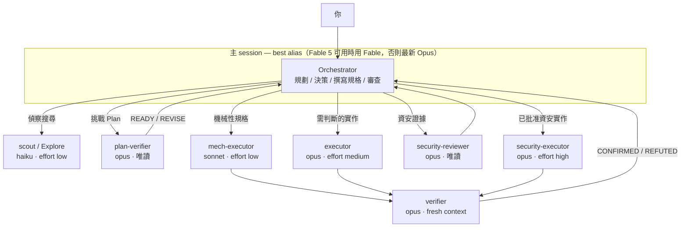

# pilotfish 🐟

> 領航魚與海中最大的掠食者同游——小而快，把例行工作攬下來，讓大傢伙專心做只有牠能做的事。

**pilotfish** 是 [Claude Code](https://code.claude.com) 的多模型協作層：前沿模型（Claude Fable 5 / Opus）在主 session 負責規劃、決策與審查，便宜的模型（Opus / Sonnet / Haiku）透過全域 subagent 承接大量執行工作。品質靠 fresh-context 驗證把關，而不是靠處處使用最大的模型。所有設定安裝在全域層——設定一次、所有專案生效——而且整套架構在前沿模型不可用時能無感降級。

> **想在 Claude Code 裡使用 OpenAI GPT-5.6，又不改動原生 Claude state？** [remora](https://github.com/Nanako0129/remora-cc) 把 pilotfish 的角色分工模式包裝成 session-scoped launcher，連接既有的 Anthropic-compatible gateway。想研究或客製全域 orchestration policy，可以使用 pilotfish；想要經過批准、可驗證，而且 model 與 gateway override 會隨 child process 消失的安裝方式，可以使用 remora。

**這個專案的由來：** 某天早上我的週額度重置了，拿到新一週的 Fable 5 額度後做的第一件事，是要它研究上一週的額度為什麼蒸發。這個 repo 就是那次研究的落地成果，也是我現在每個專案每天都在跑的設定——三個設定檔，沒有任何 runtime 程式碼。附出處的研究筆記在 [docs/](./docs/)。

[English README](./README.md)

## 目錄

- [為什麼](#為什麼)
- [運作方式](#運作方式)
- [安裝](#安裝)
- [信任與安全](#信任與安全)
- [安裝內容](#安裝內容)
- [更新](#更新)
- [Fallback 機制](#fallback-機制)
- [調校與常見問題](#調校與常見問題)
- [研究與設計](#研究與設計)
- [移除](#移除)
- [授權](#授權)

## 為什麼

前沿模型的 session 貴在訂閱者最痛的地方：Claude Fable 5 消耗訂閱額度的速度**約為 Opus 的 2 倍**（官方 UI 原文），而重度使用工具的 agentic session 實際消耗還要陡得多。但一個 coding session 裡大多數 token 並不是「判斷」——是搜尋、機械性編輯、跑測試、更新文件，這些工作便宜的模型做得一樣好。

這套做法的每一塊現在都有 Anthropic 背書。[Fable 5 prompting 指南](https://platform.claude.com/docs/en/build-with-claude/prompt-engineering/prompting-claude-fable-5)建議頻繁委派 subagent，並指出「**獨立的 fresh-context 驗證者 subagent 效果優於模型自我批判**」；而 2026-07-08 起，「便宜模型執行」也有了官方 benchmark：Anthropic 自家測試中 **Fable 5 orchestrator + Sonnet 5 workers 達到全 Fable 效能的 96%、成本只要 46%**（BrowseComp：準確率 86.8% vs 90.8%、每題 $18.53 vs $40.56），反向的 advisor 模式（Sonnet 執行、諮詢 Fable）則是約 92% 效能、63% 成本（SWE-bench Pro）——pilotfish 採用的 orchestrator 分工在兩個軸上都勝出（[multi-agent 文件](https://platform.claude.com/docs/en/managed-agents/multi-agent)）。社群實驗在業餘規模指向同一方向——高度委派的 12-worker 稽核（[Developers Digest](https://www.developersdigest.tech/blog/fable-5-orchestrator-model-playbook)），偏最佳情境、API 美元計價：

| 配置（12-worker 稽核實驗，Developers Digest） | 成本 | 節省 |
|---|---|---|
| 全程 Fable 5 | $14.50 | — |
| Fable 5 協調 + Sonnet workers | $6.10 | 58% |
| Fable 5 協調 + Haiku workers | $3.70 | 74% |

訂閱制用戶還能疊加兩個額外紅利：

> **提示：** Claude 訂閱採雙桶每週限額（[官方文章](https://support.claude.com/en/articles/14552983-models-usage-and-limits-in-claude-code)）——共用的「所有模型」桶之外，另有一個 **Sonnet 專用的額外桶**。把執行工作路由給 Sonnet subagent 不只單價便宜，還能動用這份額外的專屬額度。（Sonnet 用量仍會計入「所有模型」桶——這是額外配額，不是完全獨立的池子。）

> ⚠️ **警告：** Claude Code v2.1.198 起，內建的 `Explore` subagent 會繼承主 session 的模型。如果你的主 session 跑 Fable 5 或 Opus，每一次背景搜尋都在燒 Opus 級的 token（Claude API 上 Explore 繼承的模型以 Opus 封頂；第三方平台無此上限）。pilotfish 會把它覆寫回 Haiku。（坦白揭露一個代價：自訂的 Explore 會像一般 subagent 一樣載入你的使用者記憶，而內建版會跳過——政策區塊對 subagent 角色會自我停用，把這個開銷壓到最小。）

> **注意：** 上面兩點是訂閱方案的機制。在按 token 計費的 API 上，單價層面的節省依然成立（但沒有週額度桶）；在 Bedrock / Vertex / Foundry 上，alias 解析到各平台的內建預設版本、Fable 5 未必開通——依賴 `best` 之前，先用 `ANTHROPIC_DEFAULT_*_MODEL` 環境變數釘選版本。

## 運作方式

三層架構、三處設定，全部在 `~/.claude/` 底下：

| 層 | 檔案 | 職責 |
|---|---|---|
| 機器層 | `~/.claude/settings.json` | 決定誰當 orchestrator（`best`）＋自動 `fallbackModel` 切換鏈 |
| 角色層 | `~/.claude/agents/*.md` | 八個角色 agent，以 frontmatter 綁定正確模型層級與 capability surface |
| 政策層 | `~/.claude/CLAUDE.md` | 規範「怎麼委派」——只寫角色，永不寫模型名 |



八個角色：

| 角色 | 模型 | Effort | 用途 |
|---|---|---|---|
| `scout` | haiku | low | 唯讀查找：「X 在哪／怎麼運作」、symbol 用法、設定值 |
| `Explore` | haiku | low | 覆寫內建 Explore agent（見上方警告） |
| `plan-verifier` | opus | medium | 批准前以 tool 強制唯讀挑戰 Plan；回覆 READY/REVISE |
| `security-reviewer` | opus | high | 批准前以 tool 強制唯讀收集資安證據與 threat review |
| `mech-executor` | sonnet | low | 規格完整的機械性工作：pattern 重構、照慣例寫測試、文件、批次編輯 |
| `executor` | opus | medium | 需要判斷的實作：功能開發、bug 修復、涉及設計的重構 |
| `verifier` | opus | medium | 實作後 fresh-context outcome verification；回覆 CONFIRMED/REFUTED，永不動手修 |
| `security-executor` | opus | high | 已批准的資安實作——刻意不走 Fable 5，其安全分類器可能誤拒良性的防禦性資安工作 |

政策層現在依階段套用不同的 dispatch brake，不再要求所有委派開始前就先決定最終實作。小而穩定的工作仍直接完成；大型或模糊工作可以先做有界的唯讀 discovery，再回到 main session 彙整成一份 Plan。重要 Plan 可接受 fresh readiness review，且 writing agent 開始前要先經過使用者批准。進入 execution 後，scope、獨佔 ownership、done criteria、整合與驗證仍必須穩定。所有已命名角色的 model 只來自 agent 定義，可獨立推進的工作放到背景，而前景只保留給立即相依且淨效益仍為正的工作。

| 階段 | pilotfish 行為 |
|---|---|
| Discovery | `scout`／`Explore` 在穩定的 research contract 下收集有界事實；此時實作結果可以仍未知 |
| Plan | Main session 整合證據，負責 scope、相依、ownership、budget、stop condition 與驗收方式；`plan-verifier` 可透過唯讀 tools 挑戰它 |
| Approval | 大型、架構性、高風險或明確要求 plan-first 的工作，在 source write 或 implementation brief 開始前等待明確批准 |
| Execution | `mech-executor`、`executor` 或 `security-executor` 接收一份穩定且 ownership 獨佔的 contract |
| Verification | `verifier` 透過 read-and-run tools 嘗試推翻已完成的非平凡工作；最終判斷仍由 main session 負責 |

長時間 process 仍由 main session 擁有。所有可用 Bash 的 leaf role（`mech-executor`、`executor`、`verifier`、`security-executor`）只以前景方式執行有界 command，不會用 `nohup`、`setsid`、尾端 `&` 或 subagent-side background execution 來 detach；若工作無法在 10 分鐘內完成，就把精確 command、絕對 worktree／working directory、必要 environment 與 input paths 交回 orchestrator。Orchestrator 必須在同一個 context 執行，不能默認改到 parent checkout。任何可能執行長 command 的 agent，本身必須用 `run_in_background: true` spawn，才能保留 harness tracking 與 completion notification。

## 安裝

建議的路徑是先把釘選的 v1.2.0 release clone 到本機，再從該 checkout 啟動 Claude Code，讓它讀取本地 runbook：

```sh
git clone --branch v1.2.0 --depth 1 https://github.com/Nanako0129/pilotfish.git
cd pilotfish
claude
```

在這個 Claude Code session 貼上：

```text
Read the local file install/AGENT-INSTALL.md in the current checkout and follow it to install pilotfish into my global Claude Code configuration.
Show me the full plan of changes and get my approval before writing anything.
```

Claude 會讀取本地安裝 runbook、檢查你既有的設定、先給你一份合併計畫（不會盲目覆寫任何東西），經你同意後才動手。安裝是冪等的——重跑一次等於原地升級。

> **Runtime 要求：** Claude Code **2.1.207 或更新版本**。這是已驗證會強制執行 agent `tools` allowlist 的最低基準；pilotfish 仰賴這項強制力，確保 `plan-verifier` 與 `security-reviewer` 在批准前保持唯讀。若版本更舊或無法辨識，安裝程式會在變更任何檔案前停止。更舊版本也可能拒絕 `best` 或忽略 `effort`。原生 Windows（無 WSL）下 runbook 的 shell 指令假設 POSIX 環境，安裝代理已被指示改用自身檔案工具處理。安裝後請重啟 session：agents 目錄在 session 啟動時掃描，`model` 設定在重啟後生效。

為方便起見，也可以貼上下面的 GitHub raw prompt。這是可變動、未釘選的便利路徑：它跟著 `main` 走，因此從審閱到安裝之間，runbook 與範本可能各自變動；此外，Claude Code 的 WebFetch prompt-injection 防護可能會攔截一份直接對 AI 下達安裝指示的遠端文件。若被攔截，請改用上面的本地 checkout 路徑；不要停用或繞過安全檢查。

```text
Read https://raw.githubusercontent.com/Nanako0129/pilotfish/main/install/AGENT-INSTALL.md
and follow it to install pilotfish into my global Claude Code configuration.
Show me the full plan of changes and get my approval before writing anything.
```

想手動安裝？同樣的步驟寫在 [install/AGENT-INSTALL.md](./install/AGENT-INSTALL.md)，所有安裝檔的原始範本都在 [templates/](./templates/)。

## 信任與安全

pilotfish 的安裝方式，是讓 Claude 從本 repo 讀取 runbook 與範本檔、合併進你的全域 `~/.claude/` 設定——其中包含一段會載入**未來每一個 session** 的政策區塊。請把它當成任何 `curl | sh` 看待：信任來自這個 repo 與你的 GitHub 連線，而不是那段貼上的文字。建議使用本地 checkout，因為你可以先檢查釘選的 release，再讓 Claude 讀取 runbook。執行前：

- **實際會被裝進去的檔案要親自讀過**，不只是 runbook：就是 [templates/agents/](./templates/agents/) 的八個檔案加上 [templates/claude-md.orchestration.md](./templates/claude-md.orchestration.md)。除此之外不會寫入任何東西。
- **釘選到 release tag 或 commit**，確保你審過的就是實際裝的——從你讀它、到 Claude 讀它之間，`main` 是可能變動的。上面的建議指令已釘選 `v1.2.0` release tag；要最嚴格保證時，請先 fetch 並 checkout 你審閱過的完整 commit SHA，再在啟動 Claude 前驗證 checkout。
- **保留 approval gate：** 經你同意前 Claude 不會動手，但計畫仍只是 runbook 的摘要。請自行審閱本地 runbook 與範本；若 raw URL 被攔截，也不要削弱或繞過 WebFetch 的 prompt-injection 防護。

## 安裝內容

| 目標 | 變更 | 可還原 |
|---|---|---|
| `~/.claude/settings.json` | `model` → `"best"`、新增 `fallbackModel: ["opus", "sonnet"]`、擴充 `availableModels`（僅在你原本就有此限制時） | 可——各 key 彼此獨立 |
| `~/.claude/agents/` | 八個角色 agent 檔（如上表） | 可——刪檔即可 |
| `~/.claude/CLAUDE.md` | 一段 `## Orchestration`，包在 `<!-- pilotfish:begin/end -->` 標記之間 | 可——移除標記區塊 |

不會寫入任何專案目錄。這是刻意的設計——理由見設計文件。

## 更新

安裝程式是冪等的，所以**把安裝 prompt 再貼一次就是更新**——沒變的檔案自動跳過、政策區塊原地替換、settings 只在缺 key 時才動。要釘選版本更新時，先取得想升級到的 release tag，把該 tag 的 checkout clone 到本機，再從裡面啟動 Claude Code：

```sh
git clone --branch <RELEASE_TAG> --depth 1 https://github.com/Nanako0129/pilotfish.git
cd pilotfish
claude
```

如果需要改用完整 commit SHA，請先 fetch 並 checkout 該 SHA，再啟動 Claude Code。

接著貼上：

```text
Read the local file install/AGENT-INSTALL.md in the current checkout and follow its "Updating an existing install" section: detect my installed pilotfish version, show me the changelog since then, and upgrade after my approval.
```

[安裝](#安裝)裡的 raw `main` prompt 仍是可變動的便利路徑，不是釘選或可靠的更新路徑；它可能被 WebFetch 的 prompt-injection 防護攔截，也不可以拿來繞過這道防護。

| 想要…… | 做法 |
|---|---|
| 查目前安裝的版本 | `grep -o "pilotfish v[0-9.]*" ~/.claude/CLAUDE.md`——有標記但查不到版本＝v1.1.0 之前的安裝，建議更新 |
| 收到新版通知 | 在 GitHub 對本 repo 按 **Watch → Custom → Releases** |
| 看改了什麼 | [CHANGELOG.md](./CHANGELOG.md)——每個版本都有對應的 git tag |
| 凍結在審核過的版本 | 用 tag 或 SHA 釘選安裝（見[信任與安全](#信任與安全)）——釘選的安裝在你重新釘選前不會變動 |

## Fallback 機制

前沿模型消失時整套架構照常運作，因為政策文字從不指名模型：

| 失效情境 | 誰接住 | 你要做什麼 |
|---|---|---|
| Fable 5 離開你的方案（如 2026 年 7 月的訂閱變動） | `best` 重新解析為最新 Opus——這是文件規則，也是 2026 年 6 月停用期的實際行為（通知橫幅、新 session 自動改跑 Opus） | 大多不用做——邊界當下的確切 UI 官方未發布，最壞情況是手動 `/model` 一次或啟用 usage credits。切勿釘死 `fable`／完整 ID：6 月時釘死 ID 的人收到硬性錯誤 |
| 模型過載／API 錯誤 | `fallbackModel: ["opus", "sonnet"]` 自動切換並顯示通知 | 不用做 |
| 某層模型被棄用（Opus 4.8 → 4.9、Sonnet 5 → 下一代） | 角色 agent 用 alias（`opus`、`sonnet`、`haiku`），自動跟隨官方推薦版本 | 不用做 |
| 前沿模型在任務中途拒絕資安工作 | 資安工作一開始就路由給 `security-executor`（Opus），根本不會碰到分類器 | 不用做 |

`CLAUDE.md` 裡的委派政策只提角色（`executor`、`scout`……）。模型綁定只存在一個地方——每個 agent 檔的一行 frontmatter——要改指向，改一行、處處生效。

## 調校與常見問題

| 問題 | 回答 |
|---|---|
| 想省更多額度 | 主 session 切 `/model opusplan`——plan mode 用 Opus 思考、執行切 Sonnet。底下的角色 agent 照常運作。 |
| 能強制所有 subagent 用同一個模型嗎？ | `CLAUDE_CODE_SUBAGENT_MODEL` 會覆蓋*所有* agent 的 frontmatter——所以 pilotfish 不設它。除非要臨時全域覆寫，否則別設。 |
| 我有設 `availableModels` 白名單 | 那名單必須包含 agents 用到的所有 alias（`opus`、`sonnet`、`haiku`），否則那些 agent 會被靜默跳過、改為繼承主 session 模型。安裝程式會檢查這件事。 |
| 為什麼便宜角色都設 `effort: low`？ | Effort 是第二大額度槓桿。Fable 5 世代的模型在 low effort 常已達前代 `xhigh` 的水準；偵察與機械性工作不需要深度思考。 |
| 主 session 用哪個 effort？ | `high`。Fable 5 官方建議：大多數工作用 `high`，`xhigh` 留給最長時程的任務，`max` 少用——報酬遞減。 |
| 會失去 1M context window 嗎？ | 不會——Fable 5 預設即 1M，`best` 解析到 Fable 5 時就是 1M。若想在 `best` 降級到 Opus 時也*保證* 1M，把 `model` 改設 `"opus[1m]"`（`[1m]` 後綴的文件支援範圍是 `sonnet`/`opus`/`opusplan`/完整 model ID，不含 `best`）。 |
| Orchestrator 自己完全不動手嗎？ | 會動手——馬上要用的閱讀、少量 repo 檔案掃描、決策、根因探索、trace-driven debugging，以及你明確要*它*判斷的事。其他工作只有在成本、context、時間、隔離或驗證的整體效益高於重建與整合成本時才委派。 |
| 我的專案有自己的 CLAUDE.md，會衝突嗎？ | 檔案完全不會被動到：pilotfish 只寫 `~/.claude/` 底下。執行時 Claude Code 把專案層與使用者層記憶「疊加」載入——兩者同時生效、互不覆寫。若某個 repo 需要不同行為，在該專案的 CLAUDE.md 寫一條在地規則（例如「這個 repo 內直接動手、不委派」）——實務上較具體的指示會勝出。 |
| 我也裝了 delegation-planning skill | 請把它視為互補的規劃層。[Baton](https://github.com/cablate/baton) 這類 skill 可以塑造 discovery 問題、worker 數量、ownership、順序與 stop condition；pilotfish 提供具名 Claude 角色、模型分流、leaf-agent 邊界、approval gate 與 verifier contract。[公開雙 turn 相容性 Gate](./benchmarks/baton-compatibility/README.zh-TW.md) 已完成 Discovery → main-session Plan → `READY` → 明確批准 → execution → fresh `CONFIRMED` verification。面對小型 fixture，Baton 正確讓 Discovery 留在 main session，再把已批准的機械性撰寫委派給 `mech-executor`，並交由 `verifier` 驗證。pilotfish 不會停用使用者 skills。 |
| 擔心 subagent 品質 | 兩個獨立 fresh-context role 分別守住邊界：唯讀 `plan-verifier` 在批准前挑戰重要 Plan；outcome `verifier` 在實作後嘗試推翻完成結果。官方口徑：fresh-context 驗證者優於自我批判。剩下的交給升級規則（兩次失敗 → 升一層）。驗證本身也不是免費的——它在 Opus 上重讀 context——所以小型工作會略過。 |
| Spawn agent 不是有額外成本嗎？ | 有——每次 spawn 都是全新 context、要重讀它負責的那部分 codebase，彙整也花 main session 的 token。因此有界的 task-local 掃描預設直接完成；若互相獨立的證據能實質降低 Plan 不確定性，discovery 仍可 fan-out，而 execution 要等 contract 穩定後才委派。公開機械式 control 的 execution-only 區段中，委派的 reported cost field 降低 36.01%，代價是 wall time 增加 7.92%；兩個比較 run 都沒有包含必要的 outcome verifier，因此只能證明便宜 route 可到達，不能宣稱完整 lifecycle savings。研究 fixture 只證明兩個 scout 在該小型任務上的 overhead，不代表 plan-first discovery 一律錯誤。 |
| 怎麼快速關掉？ | **只關這個 session：** 直接跟 Claude 說「這個 session 不要委派，全部直接動手」——那只是政策文字，它立刻照辦。**只關這個 repo：** 在該 repo 的 CLAUDE.md 加一條在地規則。**整台機器：** 把 `~/.claude/CLAUDE.md` 裡的 `pilotfish:begin/end` 區塊註解掉——agent 檔留著閒置即可。切回來不必重裝。 |
| 公司管的機器（managed）？ | Managed settings 優先於使用者層設定：managed 的 `model`、`availableModels` 白名單、或同名的 managed agent 都會蓋過 pilotfish 的使用者層安裝。重啟後角色沒生效就找管理員——pilotfish 設計上不會（也不該）繞過管理政策。 |

## 研究與設計

這個 repo 是一輪有出處的研究（官方文件、Anthropic 公告、社群實測）加上設計論證的落地成果：

| 文件 | 語言 | 內容 |
|---|---|---|
| [docs/research.zh-TW.md](./docs/research.zh-TW.md) | 繁體中文 | 完整研究發現：Fable 5 的強項與何時浪費、訂閱經濟學、Claude Code 官方機制、社群實測數字——附來源 |
| [docs/research.md](./docs/research.md) | English | 研究報告的英文版（忠實翻譯） |
| [docs/design.md](./docs/design.md) | English | 為什麼是三層、為什麼政策以角色撰寫、為什麼用 alias 不釘版本、effort 分層、以及刻意不做的事 |
| [benchmarks/dispatch-brake/README.zh-TW.md](./benchmarks/dispatch-brake/README.zh-TW.md) | 繁體中文 + 數據 | 可重現 negative／positive controls、淘汰 policy、Agent traces、成本與時間證據 |
| [benchmarks/dispatch-brake/positive-controls/README.zh-TW.md](./benchmarks/dispatch-brake/positive-controls/README.zh-TW.md) | 繁體中文 + 數據 | 機械式委派證據，以及小型唯讀 fan-out 的 task-local overhead 與解讀限制 |
| [benchmarks/baton-compatibility/README.zh-TW.md](./benchmarks/baton-compatibility/README.zh-TW.md) | 繁體中文 + 數據 | 完整原生 Claude 雙 turn Baton lifecycle、精確 prompts、被拒絕的 harness run、routing 證據與機器可讀結果 |

**先行者與致意。** 「聰明的腦、便宜的手」這個分工不是 pilotfish 發明的：Anthropic 自己的工程文（[Decoupling the brain from the hands](https://www.anthropic.com/engineering/managed-agents)）就是這個框架，Claude Code 內建 [`opusplan`](https://code.claude.com/docs/en/model-config)——如果你只想要更省的 session，`/model opusplan` 根本不需要裝任何 repo——而 [Rylaa/fable5-orchestrator](https://github.com/Rylaa/fable5-orchestrator) 早就把同樣的節流理念做成帶 ledger 強制 hook 的 plugin。pilotfish 的貢獻在打包方式：刻意只有八個角色而非上百個 agent 的目錄、寫成角色而能撐過模型換代的政策、動手前先出示計畫的安裝流程、以及經過對抗式查核的宣稱。如果你偏好更重、有 hook 強制力的路線，用他們的。

## 移除

告訴 Claude Code：

```text
Uninstall pilotfish: remove the eight pilotfish agent files from ~/.claude/agents/,
delete the <!-- pilotfish:begin --> ... <!-- pilotfish:end --> block from ~/.claude/CLAUDE.md,
and offer to restore my previous "model" / remove "fallbackModel" in ~/.claude/settings.json.
```

## 授權

[MIT](./LICENSE)
