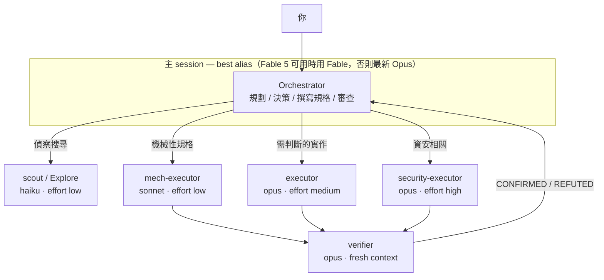

# pilotfish 🐟

> 領航魚與海中最大的掠食者同游——小而快，把例行工作攬下來，讓大傢伙專心做只有牠能做的事。

**pilotfish** 是 [Claude Code](https://code.claude.com) 的多模型協作層：前沿模型（Claude Fable 5 / Opus）在主 session 負責規劃、決策與審查，便宜的模型（Opus / Sonnet / Haiku）透過全域 subagent 承接大量執行工作。品質靠 fresh-context 驗證把關，而不是靠處處使用最大的模型。所有設定安裝在全域層——設定一次、所有專案生效——而且整套架構在前沿模型不可用時能無感降級。

[English README](./README.md)

## 目錄

- [為什麼](#為什麼)
- [運作方式](#運作方式)
- [安裝](#安裝)
- [安裝內容](#安裝內容)
- [Fallback 機制](#fallback-機制)
- [調校與常見問題](#調校與常見問題)
- [研究與設計](#研究與設計)
- [移除](#移除)
- [授權](#授權)

## 為什麼

前沿模型的 session 貴在訂閱者最痛的地方：Claude Fable 5 消耗訂閱額度的速度**約為 Opus 的 2 倍**（官方 UI 原文），而重度使用工具的 agentic session 實際消耗還要陡得多。但一個 coding session 裡大多數 token 並不是「判斷」——是搜尋、機械性編輯、跑測試、更新文件，這些工作便宜的模型做得一樣好。

Orchestrator / executor 分工有官方背書：Anthropic 的 Fable 5 prompting 指南明確建議頻繁委派 subagent，並指出「**獨立的 fresh-context 驗證者 subagent 效果優於模型自我批判**」。省下的錢是實測出來的，不是推論：

| 配置（12-worker 稽核實驗，Developers Digest） | 成本 | 節省 |
|---|---|---|
| 全程 Fable 5 | $14.50 | — |
| Fable 5 協調 + Sonnet workers | $6.10 | 58% |
| Fable 5 協調 + Haiku workers | $3.70 | 74% |

訂閱制用戶還能疊加兩個額外紅利：

> **提示：** Claude 訂閱採雙桶每週限額——「所有模型」一桶、**Sonnet 專用另一桶**。把執行工作路由給 Sonnet subagent 不只是單價便宜，而是把消耗轉移到另一個池子。

> ⚠️ **警告：** Claude Code v2.1.198 起，內建的 `Explore` subagent 會繼承主 session 的模型。如果你的主 session 跑 Fable 5 或 Opus，每一次背景搜尋都在燒前沿模型價格的 token。pilotfish 會把它覆寫回 Haiku。

## 運作方式

三層架構、三處設定，全部在 `~/.claude/` 底下：

| 層 | 檔案 | 職責 |
|---|---|---|
| 機器層 | `~/.claude/settings.json` | 決定誰當 orchestrator（`best[1m]`）＋自動 `fallbackModel` 切換鏈 |
| 角色層 | `~/.claude/agents/*.md` | 六個角色 agent，各用一行 frontmatter 綁定到正確的模型層級 |
| 政策層 | `~/.claude/CLAUDE.md` | 規範「怎麼委派」——只寫角色，永不寫模型名 |



六個角色：

| 角色 | 模型 | Effort | 用途 |
|---|---|---|---|
| `scout` | haiku | low | 唯讀查找：「X 在哪／怎麼運作」、symbol 用法、設定值 |
| `Explore` | haiku | low | 覆寫內建 Explore agent（見上方警告） |
| `mech-executor` | sonnet | low | 規格完整的機械性工作：pattern 重構、照慣例寫測試、文件、批次編輯 |
| `executor` | opus | medium | 需要判斷的實作：功能開發、bug 修復、涉及設計的重構 |
| `verifier` | opus | medium | Fresh-context 對抗式驗證；回報 CONFIRMED/REFUTED，永不動手修 |
| `security-executor` | opus | high | 一切資安相關工作——刻意不走 Fable 5，其安全分類器可能誤拒良性的防禦性資安工作 |

政策層補上運作規則：委派時一次給完整規格（含背後的「為什麼」）、從最便宜的可行角色開始並在兩次失敗後升級、ad-hoc fan-out 必須明確指定 `model`、非平凡的變更在回報完成前必須通過 `verifier` 驗證。

## 安裝

把這一段 prompt 貼進任何 Claude Code session：

```text
Read https://raw.githubusercontent.com/Nanako0129/pilotfish/main/install/AGENT-INSTALL.md
and follow it to install pilotfish into my global Claude Code configuration.
Show me the full plan of changes and get my approval before writing anything.
```

Claude 會讀取安裝 runbook、檢查你既有的設定、先給你一份合併計畫（不會盲目覆寫任何東西），經你同意後才動手。安裝是冪等的——重跑一次等於原地升級。

> **注意：** 需要較新版的 Claude Code（`best` alias、`fallbackModel`、subagent 的 `model`/`effort` frontmatter 都是 2026 年陸續推出的功能）。安裝後請重啟 session：agents 目錄在 session 啟動時掃描，`model` 設定在重啟後生效。

想手動安裝？同樣的步驟寫在 [install/AGENT-INSTALL.md](./install/AGENT-INSTALL.md)，所有安裝檔的原始範本都在 [templates/](./templates/)。

## 安裝內容

| 目標 | 變更 | 可還原 |
|---|---|---|
| `~/.claude/settings.json` | `model` → `"best[1m]"`、新增 `fallbackModel: ["opus", "sonnet"]`、擴充 `availableModels`（僅在你原本就有此限制時） | 可——各 key 彼此獨立 |
| `~/.claude/agents/` | 六個角色 agent 檔（如上表） | 可——刪檔即可 |
| `~/.claude/CLAUDE.md` | 一段 `## Orchestration`，包在 `<!-- pilotfish:begin/end -->` 標記之間 | 可——移除標記區塊 |

不會寫入任何專案目錄。這是刻意的設計——理由見設計文件。

## Fallback 機制

前沿模型消失時整套架構照常運作，因為政策文字從不指名模型：

| 失效情境 | 誰接住 | 你要做什麼 |
|---|---|---|
| Fable 5 離開你的方案（如 2026 年 7 月的訂閱變動） | `best` alias 自動解析為最新 Opus | 不用做 |
| 模型過載／API 錯誤 | `fallbackModel: ["opus", "sonnet"]` 自動切換並顯示通知 | 不用做 |
| 某層模型被棄用（Opus 4.8 → 4.9、Sonnet 5 → 下一代） | 角色 agent 用 alias（`opus`、`sonnet`、`haiku`），自動跟隨官方推薦版本 | 不用做 |
| 前沿模型在任務中途拒絕資安工作 | 資安工作一開始就路由給 `security-executor`（Opus），根本不會碰到分類器 | 不用做 |

`CLAUDE.md` 裡的委派政策只提角色（`executor`、`scout`……）。模型綁定只存在一個地方——每個 agent 檔的一行 frontmatter——要改指向，改一行、處處生效。

## 調校與常見問題

| 問題 | 回答 |
|---|---|
| 想省更多額度 | 主 session 切 `/model opusplan`——plan mode 用 Opus 思考、執行切 Sonnet。底下的角色 agent 照常運作。 |
| 能強制所有 subagent 用同一個模型嗎？ | `CLAUDE_CODE_SUBAGENT_MODEL` 會覆蓋*所有* agent 的 frontmatter——所以 pilotfish 不設它。除非要臨時全域覆寫，否則別設。 |
| 我有設 `availableModels` 白名單 | 那名單必須包含 agents 用到的所有 alias（`opus`、`sonnet`、`haiku`），否則那些 agent 會被靜默跳過、改為繼承主 session 模型。安裝程序會檢查這件事。 |
| 為什麼便宜角色都設 `effort: low`？ | Effort 是第二大額度槓桿。Fable 5 世代的模型在 low effort 常已達前代 `xhigh` 的水準；偵察與機械性工作不需要深度思考。 |
| 主 session 用哪個 effort？ | `high`。Fable 5 官方建議：大多數工作用 `high`，`xhigh` 留給最長時程的任務，`max` 少用——報酬遞減。 |
| Orchestrator 自己完全不動手嗎？ | 會動手——馬上要用的單檔閱讀、決策、以及你明確要*它*判斷的事。委派有開銷，政策裡寫明了這些例外。 |
| 擔心 subagent 品質 | 這正是 `verifier` 的職責：獨立 fresh-context、以「推翻」為目標的驗證。官方口徑：fresh-context 驗證者優於自我批判。剩下的交給升級規則（兩次失敗 → 升一層）。 |

## 研究與設計

這個 repo 是一輪有出處的研究（官方文件、Anthropic 公告、社群實測）加上設計論證的落地成果：

| 文件 | 語言 | 內容 |
|---|---|---|
| [docs/research.zh-TW.md](./docs/research.zh-TW.md) | 繁體中文 | 完整研究發現：Fable 5 的強項與何時浪費、訂閱經濟學、Claude Code 官方機制、社群實測數字——附來源 |
| [docs/design.md](./docs/design.md) | English | 為什麼是三層、為什麼政策以角色撰寫、為什麼用 alias 不釘版本、effort 分層、以及刻意不做的事 |

## 移除

告訴 Claude Code：

```text
Uninstall pilotfish: remove the six pilotfish agent files from ~/.claude/agents/,
delete the <!-- pilotfish:begin --> ... <!-- pilotfish:end --> block from ~/.claude/CLAUDE.md,
and offer to restore my previous "model" / remove "fallbackModel" in ~/.claude/settings.json.
```

## 授權

[MIT](./LICENSE)
