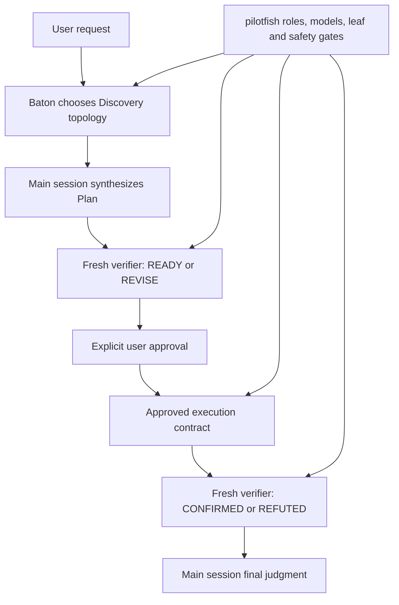

# pilotfish + Baton compatibility gate

## Contents

- [Purpose](#purpose)
- [Composition contract](#composition-contract)
- [Isolation and reproduction](#isolation-and-reproduction)
- [Exact prompts](#exact-prompts)
- [Final gate result](#final-gate-result)
- [Rejected harness run](#rejected-harness-run)
- [Limits and disclosure](#limits-and-disclosure)

## Purpose

This experiment tests whether [Baton](https://github.com/cablate/baton) and the phase-aware pilotfish v1.1.6 candidate can complete a real plan-first lifecycle under native Claude routing. Baton owns the smallest useful delegation topology; pilotfish remains authoritative for named roles, role models, leaf-agent boundaries, approval, and verifier vocabulary.

> **Gate:** Discovery may happen before the implementation outcome is known, but writes wait for a main-session Plan and explicit approval. Plan review returns `READY` / `REVISE`; outcome review returns `CONFIRMED` / `REFUTED`.

The fixture is the [two-surface research control](../dispatch-brake/positive-controls/research/fixture) first published in pilotfish commit `5f027b8c`. The run used Claude Code 2.1.207, native first-party Claude authentication, the PR #10 candidate policy, and the installed Baton skill whose `SKILL.md` SHA-256 is recorded in [`results.json`](./results.json).

## Composition contract



| Layer | Owns | Must not override |
|---|---|---|
| Baton | Questions, topology, worker count, ownership, sequence, budgets, stop conditions | Named-role models, approval, verifier mode, leaf boundary |
| pilotfish | Named roles, role models, phase gates, approval contract, verifier vocabulary | Baton's topology judgment inside those gates |
| Main session | Evidence reconciliation, Plan synthesis, integration, final judgment | Required approval or independent verification |

## Isolation and reproduction

The test ran in a disposable Git repository. The exact tested policy and session-scoped role JSON are committed under [`gate-snapshot/`](./gate-snapshot/); the JSON was originally converted byte-for-byte from six candidate role definitions by [`build-agents-json.py`](./build-agents-json.py). This avoids overwriting the installed global pilotfish files and makes the tested working-tree snapshot auditable rather than asking readers to reconstruct it from the base commit. User memory still stacks underneath the more-specific project candidate and is disclosed as a limit; the session-scoped role definitions replace the user role definitions for this run.

> ⚠️ **Safety boundary:** `--dangerously-skip-permissions` was used only in the disposable fixture. Do not reuse it in an untrusted or valuable checkout.

```bash
SOURCE=/path/to/pilotfish-pr10
ROOT="$(mktemp -d /tmp/pilotfish-baton-gate.XXXXXX)"
WORK="$ROOT/fixture"
SNAPSHOT="$SOURCE/benchmarks/baton-compatibility/gate-snapshot"

mkdir -p "$WORK"
cp -R "$SOURCE/benchmarks/dispatch-brake/positive-controls/research/fixture/." "$WORK/"
cp "$SNAPSHOT/CLAUDE.md" "$ROOT/CLAUDE.md"
git init -q "$WORK"
git -C "$WORK" add .
git -C "$WORK" -c user.name=pilotfish-gate \
  -c user.email=pilotfish-gate@example.invalid commit -qm baseline

AGENTS_JSON="$(cat "$SNAPSHOT/agents.json")"
SESSION_ID="$(python3 -c 'import uuid; print(uuid.uuid4())')"
cd "$WORK"
```

The user setting source is intentional: Baton was installed under the user skill directory. Excluding `user` makes the Skill tool report `Unknown skill`. The project-level candidate policy is more specific than user memory, and session-scoped `--agents` definitions take precedence over user agent files.

```bash
claude --dangerously-skip-permissions \
  -p --output-format json --max-budget-usd 3 \
  --session-id "$SESSION_ID" --model best --effort high \
  --setting-sources user,project,local --strict-mcp-config \
  --agents "$AGENTS_JSON" \
  "$(cat "$SOURCE/benchmarks/baton-compatibility/prompts/turn-1.txt")"

claude --dangerously-skip-permissions \
  -p --output-format json --max-budget-usd 3 \
  --resume "$SESSION_ID" --model best --effort high \
  --setting-sources user,project,local --strict-mcp-config \
  --agents "$AGENTS_JSON" \
  "$(cat "$SOURCE/benchmarks/baton-compatibility/prompts/turn-2.txt")"
```

This gate exercises runtime policy composition and the exact Gate-snapshot role definitions. [`gate-snapshot/CLAUDE.md`](./gate-snapshot/CLAUDE.md) hashes as stored; `agents.json` is read through shell command substitution, which strips its repository trailing newline before hashing and injection. Both resulting hashes match [`results.json`](./results.json) and are locked by tests. The Gate does not separately test global file discovery or the installer; those remain covered by the installer review path and policy contract tests. A later orthogonal long-process handoff fix changed two unused executor prompts and one policy paragraph; Gate and final-candidate hashes remain separate.

## Exact prompts

| Turn | Prompt | Required stop |
|---|---|---|
| Discovery + Plan | [`prompts/turn-1.txt`](./prompts/turn-1.txt) | Baton loaded, no writes, Plan verifier uses only `READY` / `REVISE`, then wait for approval |
| Approval + execution | [`prompts/turn-2.txt`](./prompts/turn-2.txt) | Only `REPORT.md`, tests pass, fresh outcome verifier returns `CONFIRMED` |

## Final gate result

| Turn | Wall time | Client-reported cost | API turns | Models | Result |
|---|---:|---:|---:|---|---|
| Discovery + Plan | 264.368 s | $1.892037 | 8 | Fable 5 + Opus 4.8 | Baton loaded; direct discovery; Git clean; Plan verifier `READY` |
| Approved execution + verification | 230.565 s | $2.014339 | 4 | Fable 5 + Opus 4.8 | Only `REPORT.md`; `npm test` passed; outcome verifier `CONFIRMED` |
| Total | 494.933 s | $3.906375 | 12 | Fable 5 + Opus 4.8 | Complete lifecycle passed |

Baton inspected the fixture size and chose direct main-session discovery: the two surfaces total 414 lines, so worker startup and synthesis had no positive net benefit. That is a valid topology decision, not missing delegation. The main session also wrote the one-file report directly after approval because delegating would have required restating the evidence it already owned.

| Agent call | Scheduling | Invocation `model` | Observed model | Verdict |
|---|---|---|---|---|
| `verifier`: Plan readiness | Foreground | Omitted | `claude-opus-4-8` | `READY` |
| `verifier`: outcome verification | Foreground | Omitted | `claude-opus-4-8` | `CONFIRMED` |

| Acceptance check | Result |
|---|---|
| Baton availability | Skill tool returned `Launching skill: baton-dispatch` |
| Writes before approval | None; Turn 1 ended with a clean Git tree |
| Plan ownership | Main session |
| Write scope | `REPORT.md` only; 69 lines, 7,093 bytes |
| Citation verification | 57 surface citations checked by the outcome verifier |
| Repository test | `REPORT.md covers both independent surfaces with file:line evidence` |
| Verifier vocabulary | Plan `READY`; outcome `CONFIRMED`; no cross-mode labels |
| Named-role routing | Both Agent calls omitted invocation-level `model` and ran on Opus 4.8 |
| Startup resend | Not required; both turns created and grew their transcripts normally |

Machine-readable data is in [`results.json`](./results.json). The final raw transcript SHA-256 is `ed10fabf6b4daf38d1cf7c87ff8cd2eb0fb1042873140fcc0d097d872e7bf874`.

After the Gate, PR #10 accepted [@dromsak's four-trial long-process finding](https://github.com/Nanako0129/pilotfish/pull/10#issuecomment-4958570683): subagents no longer detach work from harness tracking, and the main orchestrator owns tracked background processes. This small fixture invoked neither executor and no long-running command, so rerunning the $3.91 lifecycle would not exercise that delta. The final candidate therefore publishes a separate content hash and regression test instead of implying that the Baton Gate tested long-process behavior.

## Rejected harness run

The first isolation attempt was not counted as compatibility evidence. It used `--setting-sources project,local`, which hid the user-installed Baton skill. The remaining pilotfish gates still reached a clean `READY`, but the run did not test the requested composition and no approval turn was started.

| Evidence | Value |
|---|---:|
| Wall time | 213.558 s |
| Client-reported cost | $1.627875 |
| API turns | 17 |
| Git state | Clean |
| Disposition | Rejected before Turn 2 |
| Raw transcript SHA-256 | `64376ea52a4e67192df29d8595c180ddc5017638029759a8ac13aff87d5cca81` |

This rejection is published because a behavioral pass is not enough when the dependency under test never loaded.

## Limits and disclosure

> **Do not generalize one passing run into a universal performance claim.** The gate establishes one valid lifecycle and routing trace, not an expected topology, latency, or cost.

| Limit | Consequence |
|---|---|
| Single final run | Timing and cost are observations, not population estimates |
| Client-reported cost field | It is not a provider invoice |
| Small fixture | Baton legitimately chose no discovery or writing worker; larger tasks may choose bounded fan-out |
| Dynamic role injection | Exact Gate-snapshot definitions were tested, but global agent-file discovery was outside this runtime Gate |
| Post-Gate long-process fix | Two unused executor prompts and one orthogonal policy paragraph changed after the lifecycle; separate hashes and dedicated contributor trials prevent this Gate from overclaiming coverage |
| Candidate project memory stacked over user memory | The more specific candidate policy governed the fixture; managed policy or contradictory project instructions can still change behavior |
| Locally patched Claude binary | The provider route was native first-party Claude, but other Claude Code versions need their own smoke test |
| Raw transcript not committed | It contains absolute local paths and session metadata; prompts, normalized calls, content hashes, metrics, and verdicts are published instead |
