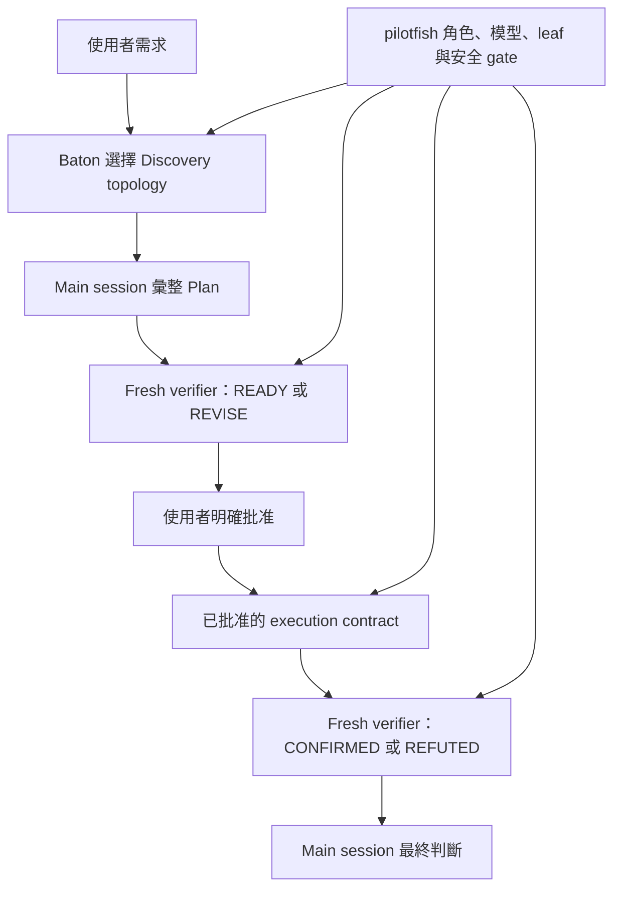

# pilotfish + Baton 相容性 Gate

## 目錄

- [目的](#目的)
- [合成契約](#合成契約)
- [隔離與重現](#隔離與重現)
- [精確 prompts](#精確-prompts)
- [最終 Gate 結果](#最終-gate-結果)
- [被拒絕的 harness run](#被拒絕的-harness-run)
- [限制與揭露](#限制與揭露)

## 目的

這項實驗驗證 [Baton](https://github.com/cablate/baton) 與 phase-aware pilotfish v1.1.6 candidate，能否在原生 Claude 路由下完成真正的 plan-first lifecycle。Baton 負責選擇最小且有淨效益的 delegation topology；pilotfish 繼續掌管具名角色、角色模型、leaf-agent 邊界、approval 與 verifier 詞彙。

> **Gate：** Discovery 可以發生在實作結果仍未知時，但 source write 必須等待 main-session Plan 與明確批准。Plan review 回覆 `READY` / `REVISE`；outcome review 回覆 `CONFIRMED` / `REFUTED`。

Fixture 是最早發佈於 pilotfish commit `5f027b8c` 的[雙 surface 研究 control](../dispatch-brake/positive-controls/research/fixture)。執行環境為 Claude Code 2.1.207、原生 first-party Claude authentication、PR #10 candidate policy，以及 `SKILL.md` SHA-256 記錄於 [`results.json`](./results.json) 的 Baton skill。

## 合成契約



| Layer | 掌管 | 不得覆寫 |
|---|---|---|
| Baton | 問題、topology、worker 數、ownership、順序、budget、stop condition | 具名角色模型、approval、verifier mode、leaf 邊界 |
| pilotfish | 具名角色、角色模型、phase gate、approval contract、verifier 詞彙 | Baton 在 gate 內的 topology 判斷 |
| Main session | 證據整合、Plan 彙整、integration、最終判斷 | 必要 approval 或獨立 verification |

## 隔離與重現

測試只在可丟棄的 Git repo 執行。實測的精確 policy 與 session-scoped role JSON 已提交於 [`gate-snapshot/`](./gate-snapshot/)；該 JSON 原先由 [`build-agents-json.py`](./build-agents-json.py) 從六個 candidate role definitions 逐字轉換。這不只避免覆寫已安裝的全域 pilotfish files，也讓實測 working-tree snapshot 可稽核，不必要求讀者從 base commit 猜回來。User memory 仍疊在較具體的 project candidate 下方，並列為限制；session-scoped roles 則會在這次 run 取代 user role definitions。

> ⚠️ **安全界線：** `--dangerously-skip-permissions` 只用在可丟棄 fixture。不要在不可信或有價值的 checkout 使用。

```bash
SOURCE=/path/to/pilotfish-pr10
ROOT="$(mktemp -d /tmp/pilotfish-baton-gate.XXXXXX)"
WORK="$ROOT/fixture"
SNAPSHOT="$SOURCE/benchmarks/baton-compatibility/gate-snapshot"

mkdir -p "$WORK"
cp -R "$SOURCE/benchmarks/dispatch-brake/positive-controls/research/fixture/." "$WORK/"
cp "$SNAPSHOT/CLAUDE.md" "$ROOT/CLAUDE.md"
git init -q "$WORK"
git -C "$WORK" add .
git -C "$WORK" -c user.name=pilotfish-gate \
  -c user.email=pilotfish-gate@example.invalid commit -qm baseline

AGENTS_JSON="$(cat "$SNAPSHOT/agents.json")"
SESSION_ID="$(python3 -c 'import uuid; print(uuid.uuid4())')"
cd "$WORK"
```

保留 user setting source 是刻意的：Baton 安裝在使用者 skill 目錄。排除 `user` 時，Skill tool 會回覆 `Unknown skill`。Project 層 candidate policy 比 user memory 更具體；session-scoped `--agents` definitions 也高於 user agent files。

```bash
claude --dangerously-skip-permissions \
  -p --output-format json --max-budget-usd 3 \
  --session-id "$SESSION_ID" --model best --effort high \
  --setting-sources user,project,local --strict-mcp-config \
  --agents "$AGENTS_JSON" \
  "$(cat "$SOURCE/benchmarks/baton-compatibility/prompts/turn-1.txt")"

claude --dangerously-skip-permissions \
  -p --output-format json --max-budget-usd 3 \
  --resume "$SESSION_ID" --model best --effort high \
  --setting-sources user,project,local --strict-mcp-config \
  --agents "$AGENTS_JSON" \
  "$(cat "$SOURCE/benchmarks/baton-compatibility/prompts/turn-2.txt")"
```

這項 Gate 驗證 runtime policy composition 與 Gate snapshot 的精確角色定義。[`gate-snapshot/CLAUDE.md`](./gate-snapshot/CLAUDE.md) 直接以 repo 內 bytes 計算 hash；`agents.json` 則透過 shell command substitution 讀取，注入與計算 hash 前會去掉檔案尾端 newline。兩個結果都與 [`results.json`](./results.json) 一致，並由 tests 鎖定。Gate 不另外驗證 global file discovery 或 installer；後兩者仍由 installer review path 與 policy contract tests 覆蓋。後來的正交 long-process handoff fix 改動兩個未被呼叫的 executor prompts 與一段 policy；Gate 與 final-candidate hashes 分開記錄。

## 精確 prompts

| Turn | Prompt | 必要停止點 |
|---|---|---|
| Discovery + Plan | [`prompts/turn-1.txt`](./prompts/turn-1.txt) | Baton 已載入、零寫入、Plan verifier 只用 `READY` / `REVISE`，接著等待批准 |
| 批准 + execution | [`prompts/turn-2.txt`](./prompts/turn-2.txt) | 只有 `REPORT.md`、測試通過、fresh outcome verifier 回 `CONFIRMED` |

## 最終 Gate 結果

| Turn | Wall time | Client-reported cost | API turns | Models | 結果 |
|---|---:|---:|---:|---|---|
| Discovery + Plan | 264.368 s | $1.892037 | 8 | Fable 5 + Opus 4.8 | Baton 已載入；直接 discovery；Git clean；Plan verifier `READY` |
| 已批准 execution + verification | 230.565 s | $2.014339 | 4 | Fable 5 + Opus 4.8 | 只有 `REPORT.md`；`npm test` 通過；outcome verifier `CONFIRMED` |
| 合計 | 494.933 s | $3.906375 | 12 | Fable 5 + Opus 4.8 | 完整 lifecycle 通過 |

Baton 檢查 fixture 規模後，選擇由 main session 直接 discovery：兩個 surface 合計 414 行，worker 啟動與彙整沒有正淨效益。這是有效的 topology 決策，不是缺少委派。取得批准後，main session 也直接撰寫單檔報告，因為委派反而要重述它已經掌握的證據。

| Agent call | 排程 | Invocation `model` | 實際 model | Verdict |
|---|---|---|---|---|
| `verifier`：Plan readiness | Foreground | 省略 | `claude-opus-4-8` | `READY` |
| `verifier`：outcome verification | Foreground | 省略 | `claude-opus-4-8` | `CONFIRMED` |

| 驗收檢查 | 結果 |
|---|---|
| Baton 可用性 | Skill tool 回覆 `Launching skill: baton-dispatch` |
| 批准前寫入 | 無；Turn 1 結束時 Git tree 乾淨 |
| Plan ownership | Main session |
| Write scope | 只有 `REPORT.md`；69 行、7,093 bytes |
| 引用驗證 | Outcome verifier 核對 57 個 surface citations |
| Repo 測試 | `REPORT.md covers both independent surfaces with file:line evidence` |
| Verifier 詞彙 | Plan `READY`；outcome `CONFIRMED`；沒有跨 mode labels |
| 具名角色路由 | 兩個 Agent call 都省略 invocation-level `model`，實際走 Opus 4.8 |
| Startup resend | 不需要；兩個 turn 的 transcript 都正常建立並持續增長 |

Machine-readable 資料位於 [`results.json`](./results.json)。最終 raw transcript SHA-256 是 `ed10fabf6b4daf38d1cf7c87ff8cd2eb0fb1042873140fcc0d097d872e7bf874`。

Gate 完成後，PR #10 接受 [@dromsak 的 4 次 long-process 實測](https://github.com/Nanako0129/pilotfish/pull/10#issuecomment-4958570683)：subagent 不再把工作 detach 出 harness tracking，改由 main orchestrator 擁有可追蹤的 background process。這個小型 fixture 沒有呼叫兩個 executor，也沒有 long-running command，因此重跑 $3.91 lifecycle 仍不會涵蓋該 delta。Final candidate 改為公開獨立 content hash 與 regression test，不假裝 Baton Gate 驗證過 long-process 行為。

## 被拒絕的 harness run

第一次隔離嘗試不列入相容性證據。它使用 `--setting-sources project,local`，因此看不到安裝在 user 層的 Baton skill。剩餘 pilotfish gate 雖然仍得到乾淨的 `READY`，但該 run 沒有測到指定 composition，也沒有啟動批准回合。

| 證據 | 值 |
|---|---:|
| Wall time | 213.558 s |
| Client-reported cost | $1.627875 |
| API turns | 17 |
| Git state | Clean |
| 處置 | Turn 2 前拒絕 |
| Raw transcript SHA-256 | `64376ea52a4e67192df29d8595c180ddc5017638029759a8ac13aff87d5cca81` |

公開這次拒絕，是因為 dependency 根本沒載入時，其他行為即使通過也不能算相容性證據。

## 限制與揭露

> **不要把單次通過外推成通用效能主張。** 這項 Gate 只建立一條有效 lifecycle 與 routing trace，不代表預期 topology、latency 或 cost。

| 限制 | 影響 |
|---|---|
| 單次 final run | 時間與 cost 是觀察值，不是母體估計 |
| Client-reported cost field | 不是 provider invoice |
| 小型 fixture | Baton 合理地沒有呼叫 discovery 或 writing worker；大型任務可能選擇有界 fan-out |
| 動態角色注入 | 已驗證精確 Gate snapshot definitions，但 global agent-file discovery 不在這次 runtime Gate 範圍 |
| Gate 後 long-process fix | 兩個未被呼叫的 executor prompts 與一段正交 policy 在 lifecycle 後變更；獨立 hashes 與 contributor 專門實測避免這項 Gate 過度宣稱 |
| Candidate project memory 疊加 user memory | 較具體的 candidate policy 管理 fixture；managed policy 或矛盾的 project instruction 仍可能改變行為 |
| 本機為 patched Claude binary | Provider route 是原生 first-party Claude，但其他 Claude Code 版本仍需自己的 smoke test |
| Raw transcript 未提交 | 內含本機絕對路徑與 session metadata；改為公開 prompts、正規化 calls、content hashes、metrics 與 verdicts |
