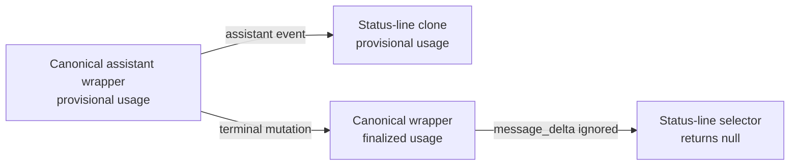

# Dispatch brake experiment: when delegation makes exploratory debugging slower

This public experiment asks whether remora and pilotfish should distinguish *role eligibility* from *dispatch eligibility*. The observed failure mode was a tightly coupled debugging task being handed from the main session to a scout and then an executor, forcing both workers to reconstruct evidence the main session already had. A second phase added positive controls after a hard brake was found to suppress useful delegation. The measurements support keeping one-path debugging chains inline, preserving stable mechanical delegation, and defaulting this small task-local audit to direct work. They do not test a complete discovery → Plan → approval → execution lifecycle.

## Contents

- [Question](#question)
- [Context and constraints](#context-and-constraints)
- [Findings](#findings)
- [Interpretation](#interpretation)
- [Recommendation](#recommendation)
- [Open questions](#open-questions)

## Question

Does a dependency-based foreground/background rule prevent wasteful delegation during exploratory debugging, or is a separate dispatch brake needed before role routing? The observable success condition is not merely a passing patch: the final policy must eliminate redundant context-reconstruction agents without removing the independent verifier gate.

## Context and constraints

The fixture reproduces the same state-clone shape that motivated the investigation. An assistant wrapper is cloned into status-line state while still provisional; a later terminal event mutates the canonical wrapper, but the reducer fails to copy finalized usage into its owned clone.



The complete fixture is in [`fixture/`](./fixture/), and the exact neutral prompt is in [`task.md`](./task.md). The prompt does not request or forbid delegation. Every run begins from the same committed fixture state with two failing tests and must preserve clone ownership.

| Environment | Value |
|---|---|
| Date | 2026-07-13, Asia/Taipei |
| Host | macOS 26.5.2 (25F84) |
| Node.js | v26.4.0 |
| Claude Code | 2.1.207, patched build |
| remora baseline | v0.1.6, commit `d2ad6e553c48de2b9a6feda199fc6f595882b5dc` |
| pilotfish baseline | v1.1.5, commit `e5b45dd2330b1ba781d9da0f80211dd657d854cf` |
| Baton reference | [baton-dispatch v0.1.1](https://github.com/cablate/baton) |
| pilotfish main model | `claude-opus-4-8` |
| remora main / worker | `gpt-5.6-sol` / `gpt-5.6-luna` |
| Permission mode | `bypassPermissions`, restricted to disposable fixture copies |

> ⚠️ **Safety boundary:** `--dangerously-skip-permissions` was used only inside disposable copies of the published fixture. Do not reuse that flag in an untrusted or valuable checkout.

The baseline runs used the installed policies. The candidate runs tested a short dispatch-brake draft. The postpatch runs used the repository policy after the first integration. Every original policy source is mapped in [`policies/`](./policies/). The short remora candidate did not contain the verifier rule, so it is disclosed for completeness but excluded from the recommended comparison. The later positive-control phase, including rejected iterations and the final sized read-only gate, is published under [`positive-controls/`](./positive-controls/).

```bash
TASK="$(sed -n '/^```text$/,/^```$/p' benchmarks/dispatch-brake/task.md | sed '1d;$d')"

/usr/bin/time -p claude -p "$TASK" \
  --output-format stream-json \
  --verbose \
  --no-session-persistence \
  --dangerously-skip-permissions \
  --max-budget-usd 3

/usr/bin/time -p remora -p "$TASK" \
  --output-format stream-json \
  --verbose \
  --no-session-persistence \
  --dangerously-skip-permissions \
  --max-budget-usd 3
```

For the postpatch runs, the exact policy file was supplied with `--append-system-prompt-file`. Full machine-readable measurements, normalized observable tool sequences, and exact Agent tool inputs are published in [`results.json`](./results.json), [`traces.json`](./traces.json), and [`agent-calls.json`](./agent-calls.json).

## Findings

The first-phase comparison uses the installed baseline and the then-current repository policy, not the shorter development candidate. The balanced release policy was refined further by the positive controls below.

| Surface | Policy | Agent calls | Foreground calls | Wall time | Reported cost field | Tests |
|---|---|---:|---:|---:|---:|---:|
| pilotfish | v1.1.5 baseline | 0 | 0 | 101.21 s | $0.460236 | 2/2 pass |
| pilotfish | first postpatch policy | 0 | 0 | 83.70 s | $0.401433 | 2/2 pass |
| remora | v0.1.6 baseline | 3 | 2 | 322.90 s | $1.316911 | 2/2 pass |
| remora | first postpatch policy | 1 | 0 | 244.24 s | $0.790973 | 2/2 pass |

The remora baseline invoked a foreground scout, a foreground executor, and a background verifier. The main session's executor brief already contained the complete root cause, which is direct evidence that the second handoff asked a worker to reconstruct a solved investigation. The final policy completed diagnosis and implementation in the main session, then retained a background verifier.

| remora metric | Baseline | Final | Change |
|---|---:|---:|---:|
| Wall time | 322.90 s | 244.24 s | −24.36% |
| Reported cost field | $1.316911 | $0.790973 | −39.94% |
| Agent calls | 3 | 1 | −66.67% |
| Foreground agent calls | 2 | 0 | −100% |
| Model input tokens | 127,487 | 48,594 | −61.88% |
| Model output tokens | 13,908 | 10,779 | −22.50% |
| Cache-read input tokens | 663,552 | 557,056 | −16.05% |
| Fresh verifier | Yes | Yes | Preserved |

All six first-phase runs are disclosed below, including the development probes.

| Run | Wall time | Turns field | Reported cost field | Agent pattern | Outcome |
|---|---:|---:|---:|---|---|
| `pilotfish-current` | 101.21 s | 17 | $0.460236 | Inline | Pass |
| `remora-current` | 322.90 s | 17 | $1.316911 | scout FG → executor FG → verifier BG | Pass |
| `pilotfish-candidate` | 83.99 s | 13 | $0.439315 | Inline | Pass |
| `remora-candidate` | 89.76 s | 22 | $0.455722 | Inline, verifier rule absent | Pass but not release-equivalent |
| `pilotfish-postpatch` | 83.70 s | 11 | $0.401433 | Inline | Pass |
| `remora-postpatch` | 244.24 s | 33 | $0.790973 | Inline diagnosis/fix → verifier BG | Pass and verifier CONFIRMED |

The final remora verifier probed reference isolation, later canonical mutation, multiple messages, repeated finalize events, and the new provisional-message case. It returned `CONFIRMED`. The published fixture tests remained 2/2 passing after every successful implementation.

### Positive controls and rejected iterations

The hard candidate was not safe to ship unchanged: pilotfish completed the 12-file mechanical task inline in 128.24 seconds at a $0.790263 reported cost field. After replacing the direct-speed veto with a net-benefit decision, the same acceptance contract routed to `mech-executor`, passed 12/12 tests, completed in 138.40 seconds, and reported $0.505682. In this execution-only segment, that is 36.01% less reported cost with a 7.92% wall-time trade-off. Neither run included the release policy's required outcome verifier, so this demonstrates route reachability rather than full-lifecycle savings.

The first net-benefit wording then spawned two background scouts for a small read-only fixture containing roughly a dozen short files. Compared with its direct run, wall time increased 11.71% and the reported cost field increased 15.61%. This supports direct inspection as the default for that task-local shape; it does not show that the same two scouts would be wasteful when their evidence feeds a larger Plan. pilotfish's exact sized-gate run completed inline in 228.96 seconds with no Agent call and passed its acceptance test.

| Control | Direct or rejected result | Balanced result | What it proves |
|---|---|---|---|
| Stable 12-file edit | pilotfish inline, 128.24 s, $0.790263 | `mech-executor`, 138.40 s, $0.505682 | The brake still permits useful delegation |
| Small read-only audit | 2 scouts, 261.52 s, $1.036893 | Inline, 228.96 s, $0.918431 | Direct work was cheaper and faster for this task-local fixture |
| Tightly coupled bug | remora baseline scout → executor → verifier | Inline diagnosis/fix → verifier, 200.86 s, $0.817504 | One evolving evidence chain stays owned by main |

The complete fixtures, prompts, all completed runs, deliberately interrupted decision probes, normalized Agent inputs, model usage, and raw-stream hashes are in [`positive-controls/`](./positive-controls/). When GPT-5.6 Sol auto-loaded the separately installed [baton-dispatch v0.1.1](https://github.com/cablate/baton) skill, Baton selected two independent read-only discovery calls. Both historical probes were deliberately stopped at that observation; neither continued through main-session Plan synthesis, user approval, execution, or verification. They therefore record a different decomposition rather than a conflict. The later [pilotfish + Baton compatibility gate](../baton-compatibility/README.md) completed the entire lifecycle under native Claude routing.

Raw stream hashes are included in [`results.json`](./results.json). The repository publishes normalized observable traces instead of raw Claude stream JSON because raw init and hook events contain local absolute paths, session identifiers, and plugin inventory unrelated to the dispatch claim. No chain-of-thought or hidden reasoning is claimed or published; the evidence is the public prompt, fixture, policies, Agent tool inputs, tool sequence, result metrics, diffs, and test outcomes.

## Interpretation

Confidence is high that the old remora policy caused unnecessary delegation in the tightly coupled workload. The behavior changed from two blocking handoffs plus verification to direct diagnosis and implementation plus verification, while correctness stayed constant. The reduction is therefore not explained by dropping the quality gate.

The positive controls also reject the opposite extreme. A universal “direct must not be faster” condition prevented the desired cheap-worker route. The release policy therefore uses phase-specific contracts: discovery requires a stable research question and stop condition but may precede a known implementation outcome; execution requires stable scope, ownership, done criteria, and closure. Eligible work is then a net-benefit decision. The mechanical control demonstrates that this is not a no-delegation policy.

Confidence is lower for any pilotfish performance claim. Its baseline already chose inline execution, so the final run establishes policy non-regression, not that the dispatch-brake wording caused the 17.30% wall-time difference. With one run per condition, model and service variance remain plausible explanations.

The `num_turns` field is not a total-work measure across delegated and non-delegated runs: child-agent work can be represented outside the parent's turn count. The `reported_cost_usd` field is Claude Code's reported estimate, not an OpenAI or Anthropic invoice, and should be read as a within-run comparison signal. Token categories are published without treating cache-read tokens as equivalent to uncached input.

## Recommendation

Keep dispatch brakes in both policies, but apply them by phase and do not make direct-work speed a hard veto. Discovery may use bounded read-only workers once its question, scope, evidence format, and stop condition are stable. Main session then synthesizes one Plan. Writing agents wait for stable scope, exclusive ownership, done criteria, closure, and any required user approval. Within those boundaries, choose by net benefit across model cost, scarce context, elapsed time, isolation, and fresh independence versus reconstruction, coordination, integration, and verification.

Root-cause discovery, trace-driven debugging, and tightly coupled state propagation should remain in the main session when they share one evolving code path. Large cross-surface investigations may use bounded read-only discovery, but return to main-session Plan synthesis before execution. Stable multi-file repetition remains a positive path to the cheap mechanical role. A small task-local scan defaults direct; substantial scan volume, overlapable latency, or evidence that materially reduces Plan uncertainty can justify discovery fan-out.

Do not replace proportionate fresh verification with inline self-review. The balanced remora control completed in 200.86 seconds and retained a fresh verifier; the faster 89.76-second development candidate remains excluded because its draft omitted that rule.

The repository-level contract tests should continue to lock the dispatch-brake language, while live behavior tests remain a release gate when orchestration wording changes materially.

## Open questions

| Question | How to close it |
|---|---|
| How stable are the time and cost deltas? | Repeat each exact condition at least five times and publish median, range, and provider status. |
| Does it generalize to large real repositories? | Replay an anonymized trace-heavy bug with stable source snapshots and identical acceptance gates. |
| Is the verifier always worth its latency? | Compare risk-classified workloads while keeping correctness probes constant; do not infer from this single fixture. |
| Are raw provider costs aligned with the client field? | Compare against provider-side usage exports when a privacy-safe, model-comparable source is available. |
| Does the phase-aware lifecycle generalize across providers and larger tasks? | The native-Claude [pilotfish Gate](../baton-compatibility/README.md) and GPT-routed [remora Gate](https://github.com/Nanako0129/remora-cc/tree/main/benchmarks/baton-compatibility) each cover one small fixture. Repeat the same gates on larger, independently scoped workloads before generalizing topology or performance. |
