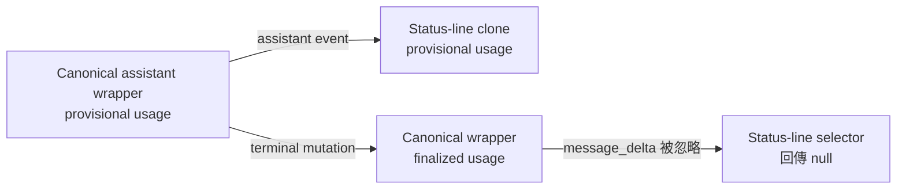

# Dispatch brake 實驗：什麼時候委派會拖慢探索型除錯

這份公開實驗要回答：remora 與 pilotfish 是否應該把「角色符合」和「值得委派」拆成兩道判斷。觀察到的失敗模式是，緊密耦合的除錯工作先後交給 scout 與 executor，兩個 worker 都重新理解 main session 已掌握的證據。第二階段加入 positive control，因為 hard brake 又被證明會壓掉有價值的委派。數據支持讓單一路徑 bug 推理鏈留在 main session、保留穩定機械式委派，並讓這個小型 task-local 稽核預設直接完成；它沒有測試完整的 discovery → Plan → approval → execution lifecycle。

## 目錄

- [問題](#問題)
- [背景與限制](#背景與限制)
- [實驗結果](#實驗結果)
- [結果解讀](#結果解讀)
- [建議](#建議)
- [待驗證問題](#待驗證問題)

## 問題

只用 foreground／background 的相依排程規則，能不能阻止探索型 debugging 的浪費性委派？還是應該在角色分流前增加獨立的 dispatch brake？成功條件不只是修正通過測試：最終 policy 必須移除重複建立 context 的 agent，同時不能拿掉獨立 verifier gate。

## 背景與限制

Fixture 重現了觸發這次調查的 state-clone 結構。Assistant wrapper 還是 provisional 時就被複製進 status-line state；terminal event 稍後修改 canonical wrapper，但 reducer 沒把 finalized usage 寫回自己持有的 clone。



完整 fixture 位於 [`fixture/`](./fixture/)，中立且未暗示是否委派的原始 prompt 位於 [`task.md`](./task.md)。每次執行都從同一份已 commit、兩個測試失敗的 fixture 開始，並要求保留 clone ownership。

| 實驗環境 | 值 |
|---|---|
| 日期 | 2026-07-13，Asia/Taipei |
| 主機 | macOS 26.5.2 (25F84) |
| Node.js | v26.4.0 |
| Claude Code | 2.1.207，patched build |
| remora baseline | v0.1.6，commit `d2ad6e553c48de2b9a6feda199fc6f595882b5dc` |
| pilotfish baseline | v1.1.5，commit `e5b45dd2330b1ba781d9da0f80211dd657d854cf` |
| Baton 參考版本 | [baton-dispatch v0.1.1](https://github.com/cablate/baton) |
| pilotfish main model | `claude-opus-4-8` |
| remora main／worker | `gpt-5.6-sol`／`gpt-5.6-luna` |
| Permission mode | `bypassPermissions`，僅用於可丟棄的 fixture copy |

> ⚠️ **安全界線：** `--dangerously-skip-permissions` 只在可丟棄的公開 fixture copy 中使用。不要把這個 flag 套用到不可信或有價值的 checkout。

Baseline 使用當時已安裝的 policy；candidate 使用較短的 dispatch-brake 草稿；postpatch 使用第一次整合後 repo 裡的 policy。所有原始階段的 policy source 對照都公開在 [`policies/`](./policies/)。較短的 remora candidate 沒包含 verifier 規則，因此完整揭露，但不列入建議版本的主要比較。後續 positive-control 階段、淘汰的迭代與最終唯讀規模 gate 都公開在 [`positive-controls/`](./positive-controls/)。

```bash
TASK="$(sed -n '/^```text$/,/^```$/p' benchmarks/dispatch-brake/task.md | sed '1d;$d')"

/usr/bin/time -p claude -p "$TASK" \
  --output-format stream-json \
  --verbose \
  --no-session-persistence \
  --dangerously-skip-permissions \
  --max-budget-usd 3

/usr/bin/time -p remora -p "$TASK" \
  --output-format stream-json \
  --verbose \
  --no-session-persistence \
  --dangerously-skip-permissions \
  --max-budget-usd 3
```

Postpatch 額外用 `--append-system-prompt-file` 傳入 repo 中的精確 policy。完整機器可讀數據、正規化後的可觀察工具序列與精確 Agent tool input 分別位於 [`results.json`](./results.json)、[`traces.json`](./traces.json) 和 [`agent-calls.json`](./agent-calls.json)。

## 實驗結果

第一階段比較使用已安裝 baseline 與當時 repo policy，不以較短的開發 candidate 取代。Balanced release policy 之後又依 positive control 繼續收斂。

| 執行面 | Policy | Agent calls | 前景 calls | Wall time | Reported cost field | 測試 |
|---|---|---:|---:|---:|---:|---:|
| pilotfish | v1.1.5 baseline | 0 | 0 | 101.21 s | $0.460236 | 2/2 pass |
| pilotfish | 第一次 postpatch policy | 0 | 0 | 83.70 s | $0.401433 | 2/2 pass |
| remora | v0.1.6 baseline | 3 | 2 | 322.90 s | $1.316911 | 2/2 pass |
| remora | 第一次 postpatch policy | 1 | 0 | 244.24 s | $0.790973 | 2/2 pass |

remora baseline 依序呼叫前景 scout、前景 executor、背景 verifier。Main session 寫給 executor 的 brief 已包含完整根因，直接證明第二次 handoff 要 worker 重建一段已完成的調查。最終 policy 讓 main session 自己完成診斷與實作，之後仍呼叫 background verifier。

| remora 指標 | Baseline | 最終版 | 變化 |
|---|---:|---:|---:|
| Wall time | 322.90 s | 244.24 s | −24.36% |
| Reported cost field | $1.316911 | $0.790973 | −39.94% |
| Agent calls | 3 | 1 | −66.67% |
| 前景 agent calls | 2 | 0 | −100% |
| Model input tokens | 127,487 | 48,594 | −61.88% |
| Model output tokens | 13,908 | 10,779 | −22.50% |
| Cache-read input tokens | 663,552 | 557,056 | −16.05% |
| Fresh verifier | 有 | 有 | 保留 |

第一階段六次觀察結果全部公開如下，包含開發過程中的 probe。

| Run | Wall time | Turns field | Reported cost field | Agent pattern | 結果 |
|---|---:|---:|---:|---|---|
| `pilotfish-current` | 101.21 s | 17 | $0.460236 | Inline | Pass |
| `remora-current` | 322.90 s | 17 | $1.316911 | scout FG → executor FG → verifier BG | Pass |
| `pilotfish-candidate` | 83.99 s | 13 | $0.439315 | Inline | Pass |
| `remora-candidate` | 89.76 s | 22 | $0.455722 | Inline，缺少 verifier 規則 | Pass，但不等同 release policy |
| `pilotfish-postpatch` | 83.70 s | 11 | $0.401433 | Inline | Pass |
| `remora-postpatch` | 244.24 s | 33 | $0.790973 | Inline 診斷／修正 → verifier BG | Pass，verifier 回報 CONFIRMED |

最終 remora verifier 額外探測 reference isolation、後續 canonical mutation、多訊息、重複 finalize 與新增 provisional message，結果為 `CONFIRMED`。所有成功修正後，公開 fixture 的既有測試都是 2/2 pass。

### Positive control 與淘汰的迭代

Hard candidate 不能原樣發布：pilotfish 在 12 檔機械式工作中選擇 inline，128.24 秒完成，reported cost field 為 $0.790263。把直接速度 veto 改成 net-benefit 後，相同驗收契約交給 `mech-executor`，12/12 測試通過，138.40 秒完成，reported cost field 為 $0.505682。這個 execution-only 區段的單次觀察中，cost field 降低 36.01%，代價是 wall time 增加 7.92%。兩個 run 都沒有包含 release policy 必要的 outcome verifier，因此只能證明便宜 route 可到達，不能宣稱完整 lifecycle savings。

第一版 net-benefit 文案接著讓約十來個短檔案的小型唯讀 fixture 呼叫兩個背景 scout；相較直接 run，wall time 增加 11.71%，reported cost field 增加 15.61%。這支持該 task-local 形狀預設直接讀，但不能證明相同兩個 scout 在為大型 Plan 提供證據時仍屬浪費。pilotfish 的精確 sized-gate run 沒有 Agent call，228.96 秒完成並通過驗收。

| Control | 直接或淘汰結果 | Balanced 結果 | 證明什麼 |
|---|---|---|---|
| 穩定 12 檔修改 | pilotfish inline，128.24 s，$0.790263 | `mech-executor`，138.40 s，$0.505682 | Brake 仍保留有價值的委派 |
| 小型唯讀稽核 | 2 scouts，261.52 s，$1.036893 | Inline，228.96 s，$0.918431 | 在這個 task-local fixture 中，直接做更快且更便宜 |
| 緊密耦合 bug | remora baseline scout → executor → verifier | Inline 診斷／修正 → verifier，200.86 s，$0.817504 | Main 持續擁有同一條演進中的證據鏈 |

完整 fixtures、prompts、所有完成 run、刻意中止的決策 probe、正規化 Agent inputs、model usage 與 raw-stream hashes 都位於 [`positive-controls/`](./positive-controls/)。GPT-5.6 Sol 自動載入另外安裝的 [baton-dispatch v0.1.1](https://github.com/cablate/baton) 後，Baton 選擇了兩個互相獨立的唯讀 discovery call。兩個歷史 probe 都刻意停在這個觀察點，沒有繼續 main-session Plan 彙整、使用者批准、execution 或 verification，因此只記錄不同的分解方式，而不是衝突。後續的 [pilotfish + Baton 相容性 Gate](../baton-compatibility/README.zh-TW.md) 已在原生 Claude 路由下完成整個 lifecycle。

[`results.json`](./results.json) 包含 raw stream SHA-256。Repo 公開的是正規化後的 observable trace，不直接提交 Claude raw stream JSON，因為 raw init／hook event 會包含與 dispatch 主張無關的本機絕對路徑、session identifier 與 plugin inventory。這份報告不宣稱也不公開 chain-of-thought 或隱藏推理；可稽核證據是公開 prompt、fixture、policies、Agent tool inputs、tool sequence、result metrics、diff 與測試結果。

## 結果解讀

對「舊 remora policy 在緊密耦合 workload 造成不必要委派」的信心高。行為從兩次 blocking handoff 加驗證，變成 main session 直接診斷與實作，再做 verification；正確性維持不變，因此改善不是靠移除 quality gate 得到的。

Positive control 也否決了另一個極端。通用的「直接做不得較快」條件會阻止需要的便宜 worker 路徑。Release policy 改用 phase-specific contract：discovery 需要穩定的研究問題與 stop condition，但不必先知道實作結果；execution 則需要穩定的 scope、ownership、done criteria 與 closure。其餘改看 net benefit。機械式 control 證明這不是 no-delegation policy。

對 pilotfish 的效能因果主張信心低。它的 baseline 原本就選擇 inline execution，所以最終結果證明 policy 沒有 regression，不能證明 wall time 少 17.30% 是 dispatch-brake 文案造成。每個條件只有一次執行，model 與 service variance 都是合理解釋。

`num_turns` 不是委派與非委派之間的總工作量指標，child-agent 工作不一定計入 parent turns。`reported_cost_usd` 是 Claude Code 回報的估算欄位，不是 OpenAI 或 Anthropic 帳單，只能當作同次實驗內的比較訊號。Token 類別完整公開，但不把 cache-read token 當成等價的 uncached input 解讀。

## 建議

兩份 policy 都應保留 dispatch brake，但要依階段套用，且不能把直接工作速度設成 hard veto。Discovery 的問題、scope、證據格式與 stop condition 穩定後，可使用有界唯讀 worker；main session 接著彙整一份 Plan。Writing agent 則要等 scope、獨佔 ownership、done criteria、closure 與必要的使用者批准都穩定。其餘比較 model 成本、稀缺 context、時間、隔離與 fresh independence，相對於重建、協調、整合與驗證成本。

Root-cause discovery、trace-driven debugging 與緊密耦合的 state propagation，在共用同一條演進中的 code path 時應留在 main session。大型跨 surface 調查可使用有界唯讀 discovery，但 execution 前要回到 main-session Plan 彙整。穩定多檔重複工作仍是便宜機械角色的 positive path。小型 task-local 掃描預設直接做；相當的掃描量、可重疊 latency，或能實質降低 Plan 不確定性的證據可支持 discovery fan-out。

不要用 inline self-review 取代合比例的 fresh verification。Balanced remora control 在 200.86 秒完成並保留 fresh verifier；89.76 秒的 development candidate 因草稿缺少該規則，仍不列入建議版本。

Repo 的 policy contract tests 應持續鎖住 dispatch-brake 語意；未來只要 orchestration 文案有實質變動，就應把 live behavior test 當成 release gate。

## 待驗證問題

| 問題 | 如何補足證據 |
|---|---|
| 時間與 cost 差異有多穩定？ | 每個精確條件至少重跑五次，公開 median、range 與 provider status。 |
| 能否泛化到大型真實 repo？ | 使用固定 source snapshot 重放匿名化的 trace-heavy bug，並維持相同 acceptance gates。 |
| Verifier 的 latency 是否總是值得？ | 依風險分類比較 workload，維持相同 correctness probes；不能由單一 fixture 外推。 |
| Client cost field 是否符合 provider 實際成本？ | 未來有 privacy-safe 且 model-comparable 的 provider usage export 時再交叉核對。 |
| Phase-aware lifecycle 能否跨 provider 與大型任務泛化？ | 原生 Claude 的 [pilotfish Gate](../baton-compatibility/README.zh-TW.md) 與 GPT 路由的 [remora Gate](https://github.com/Nanako0129/remora-cc/tree/main/benchmarks/baton-compatibility) 都只涵蓋一個小型 fixture；要外推 topology 或效能前，需在更大型且真正獨立的 workload 重跑。 |
