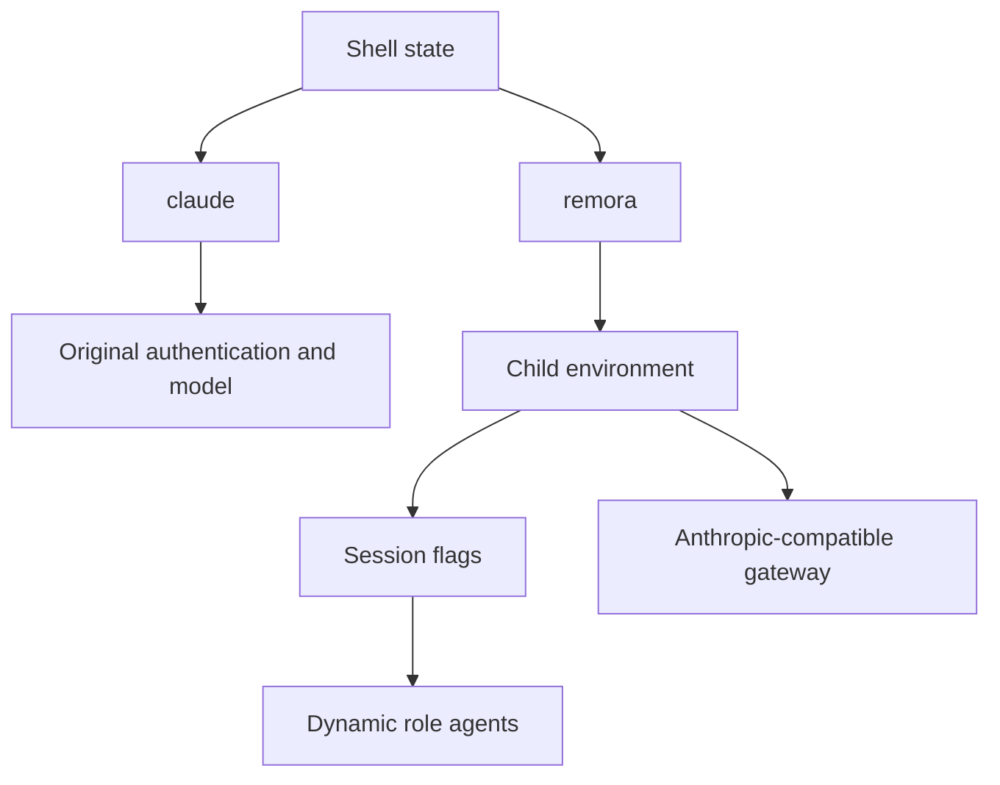
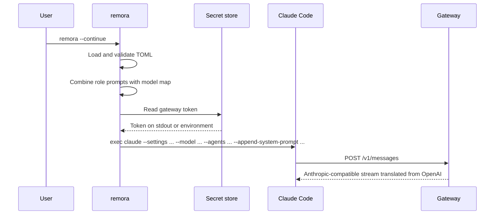

# remora Architecture

## Design goal

remora provides a second launch surface for Claude Code. It changes routing for one process tree while preserving native Claude as a fully independent control path.

## Isolation contract

| Boundary | remora behavior | Why it matters |
|---|---|---|
| Process | Uses `execvpe` with a copied environment | Overrides disappear with the child |
| Integration marker | Sets `REMORA_ACTIVE=1` in the copied environment | Status lines and hooks can identify remora without inspecting credentials or gateway URLs |
| Settings | Writes no Claude settings; passes configured model ids through child-only `--settings` | Native configuration remains authoritative outside remora while subagent validation can see gateway ids |
| Agents | Sends one JSON object through `--agents` | Claude Code scopes it to the current session |
| Orchestration | Appends a dispatch brake plus dependency-based scheduling policy | Coupled investigation stays in the main session; eligible independent work runs in background |
| Authentication | Resolves a remora-specific token, then sets `ANTHROPIC_AUTH_TOKEN` only in the child | The user's Anthropic login is neither read nor replaced on disk |
| Model defaults | Sets the three documented `ANTHROPIC_DEFAULT_*_MODEL` variables in the child | Internal Claude tiers resolve to gateway model names |
| Routing allowlist | Adds every configured gateway id to the session's `availableModels` | Claude does not silently inherit the main model for an excluded subagent id |
| Global override | Removes `CLAUDE_CODE_SUBAGENT_MODEL` from the copied child environment by default | One global variable cannot collapse every role back to one model |

Claude Code's precedence places dynamic `--agents` below managed agents but above project, user, and plugin agents. A managed organization policy can therefore still prevent or replace a remora role; remora deliberately does not bypass managed policy.

Claude Code also applies `availableModels` to subagent definitions. In 2.1.207, an excluded custom gateway id silently falls back to the parent model. remora supplies its configured ids as an additional session-only allowlist and rejects a competing explicit `--settings` argument rather than risk losing that routing control. This is a compatibility allowance, not a bypass of higher-precedence managed policy.

## Launch sequence

## Role policy

The split follows capability and token volume rather than file ownership. Read-only fan-out and fully specified mechanical work go to Luna. Work requiring design judgment, independent verification, or security reasoning goes to Sol. Subagents are leaf workers and are denied recursive delegation, preventing an unbounded agent tree.

For every existing named role, its `--agents` definition is the sole model source. The orchestrator omits the Agent tool's invocation-level `model` field because Claude Code gives that field higher precedence than the role definition. An explicit invocation model is reserved for a truly ad-hoc agent with no named definition.

Foreground versus background is a parent-orchestrator decision, so it cannot be enforced inside a leaf agent prompt. remora therefore appends a child-session-only policy: independent work and parallel fan-out use `run_in_background: true`; foreground execution is reserved for a result required by the main session's very next action when no other useful work can proceed. Explicit user `--append-system-prompt` or `--append-system-prompt-file` arguments replace this default for that session.

Scheduling begins only after a dispatch brake. A role match is an eligibility hint, not a command to spawn: root-cause discovery, trace-driven debugging, and state-propagation work remain in the main session while diagnosis and implementation depend on the same evidence. Executors receive work only after the root cause, scope, ownership, and done criteria are stable enough for a one-shot brief. This avoids paying for a worker to reconstruct context that the orchestrator already owns, then paying again to integrate its answer.

The policy change is backed by a public, reproducible [dispatch-brake experiment](https://github.com/Nanako0129/pilotfish/tree/main/benchmarks/dispatch-brake) containing the fixture, neutral task prompt, all six observed runs, normalized Agent traces, exact Agent tool inputs, raw-stream hashes, model usage, timing, reported cost fields, test outcomes, interpretation limits, and bilingual reports.

The policy change is backed by a public, reproducible [dispatch-brake experiment](https://github.com/Nanako0129/pilotfish/tree/main/benchmarks/dispatch-brake) containing the fixture, neutral task prompt, all six observed runs, normalized Agent traces, raw-stream hashes, model usage, timing, reported cost fields, test outcomes, interpretation limits, and bilingual reports.

| Decision | Chosen behavior | Rejected behavior |
|---|---|---|
| Main model | Sol by default | Changing Claude's persistent default |
| Recon | Luna, low effort | Letting built-in Explore inherit Sol |
| Mechanical execution | Luna, medium effort | Paying Sol for deterministic bulk work |
| Verification | Fresh Sol context | Self-review by the implementer |
| Security | Sol, max effort | Cheap routing at a trust boundary |
| Configuration | Model names in TOML | Hard-coded provider catalog in prompts |
| Context safety | Read the gateway ceiling, reserve output space, and scope auto-compaction to the child | Pretending every provider route has the public API's maximum window |

## Gateway semantics

Claude Code speaks the Anthropic Messages protocol, while the selected models may be OpenAI models. The gateway owns protocol translation, OAuth, model aliases, cooldown, retries, and account selection. remora owns none of those concerns; it only chooses the gateway-visible model string for each role.

Codex active-turn continuity also crosses this boundary. Native Codex preserves server-issued turn state across tool continuations, but the stock CLIProxyAPI Claude bridge does not currently retain that state. This can make a remora turn stop at a subscription allowance boundary before native Codex would stop under backend fair-use rules. The confirmed source evidence, responsibility split, non-solutions, and acceptance test are documented in [Preserving Codex Active-Turn Fair Use Through the Claude Bridge](./codex-active-turn-fair-use.md).

Context capacity crosses that boundary: the gateway catalog is authoritative for the provider route, but stock Claude Code assigns unknown custom model ids a 200K client window. remora's default `stock` policy therefore reports the truthful 200K window and leaves Claude's native compact pipeline untouched. The optional `calico` policy queries `/v1/models?client_version=remora`, takes the minimum across configured models, supplies an exact child-only model/window map to a separately verified Calico binary, reports 95% usable context, and applies the 90% compact ratio exactly once to the raw mapped window. Discovery is read-only and falls back to TOML; it never rewrites gateway metadata.

This separation makes failures diagnosable:

| Error location | Typical evidence | Owner |
|---|---|---|
| Launcher | Invalid TOML, missing token, missing `claude` binary | remora |
| Claude runtime | Invalid `--agents` field or unavailable tool | Claude Code version/configuration |
| Gateway selector | Millisecond 429 with `model_cooldown` | Gateway state |
| Upstream | Slower 429/5xx after a real network request | Provider/model/account |

## Native-Claude proof

The launcher contains no code path that opens `~/.claude` for writing. Installation targets only XDG-style remora paths. Tests also assert that clearing a global subagent override mutates only the environment copy passed to the child, not the parent process.

## Compatibility boundary

The design depends on current Claude Code support for `--agents`, agent fields such as `model` and `effort`, and custom gateway environment variables. remora validates its own shape but cannot guarantee that an arbitrary OpenAI model fully reproduces Claude-specific tool-use, caching, extended-thinking, or context-window behavior. Treat each gateway/model combination as an integration that needs an end-to-end smoke test.
