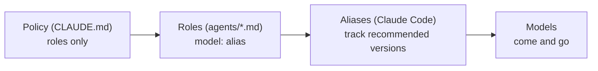

# pilotfish — Design Rationale

## Purpose

This document explains *why* pilotfish is shaped the way it is: three layers, role-based policy, aliases everywhere, effort tiers, and a verification gate. The empirical grounding (official docs, measured community numbers, subscription economics) lives in the [research report](./research.zh-TW.md); this is the argument from those facts to this design.

## The three layers

The core observation is that "who orchestrates", "who executes what", and "how delegation behaves" change at different rates and should therefore live in different places:

| Layer | File | Changes when | Mechanism |
|---|---|---|---|
| Machine | `~/.claude/settings.json` | Your plan/access changes | `model: "best"` + `fallbackModel` |
| Roles | `~/.claude/agents/*.md` | A model tier is re-pointed | One `model:` line of frontmatter per role |
| Policy | `~/.claude/CLAUDE.md` | Your working style changes | Prose rules written against role names |

CLAUDE.md cannot set the main-session model (that is a settings/`/model` concern), which turns out to be a feature: it forces the clean split where settings decide *who* orchestrates and CLAUDE.md decides *how* it delegates.

## Role-based policy, model-free prose

The single most important rule in pilotfish: **the policy text never names a model.** It says "delegate mechanical work to `mech-executor`", not "delegate to Sonnet". Model bindings exist in exactly one place — the frontmatter of each agent file.

This is what makes the fallback story degenerate into no-ops:

The June 2026 export-control suspension was a live test of this: accounts on aliases degraded gracefully — a notice banner, new sessions continuing on Opus — while users who had pinned the full `claude-fable-5` model ID got hard 404 errors. That is the fallback story working: `best` re-resolves, every role keeps its binding, and the policy text is already model-agnostic. The July 2026 subscription-to-credits boundary is expected to behave the same way per the documented resolution rule, though Anthropic has not published the exact boundary UX — worst case is one manual `/model` switch or enabling usage credits. The same holds for the next deprecation cycle (Opus 4.8 → 4.9, Sonnet 5 → next): aliases track the recommended version by design.

Three distinct failure modes get three distinct mechanisms — they are often conflated but shouldn't be:

| Failure | Mechanism | Layer |
|---|---|---|
| Lost *access* to the frontier model | `best` alias | settings |
| Model *overloaded / erroring* | `fallbackModel` chain | settings |
| Model *deprecated* | aliases in role frontmatter | agents |

## Why these six roles

The role set is the smallest one that covers the delegation patterns that actually recur, mapped to the cheapest tier that reliably handles each:

| Role | Tier argument |
|---|---|
| `scout`, `Explore` | Reconnaissance is the highest-volume, lowest-judgment token sink in a coding session (telemetry showed ~36% of calls were exploration even before deliberate routing). For *locating* facts — not judging them — Haiku at low effort is effectively equivalent; judgment stays with the orchestrator. Both roles carry a positive `tools: Read, Glob, Grep` allowlist, so "read-only" is enforced, not just prompted. |
| `mech-executor` | Fully-specified work has its judgment already done — by the orchestrator, in the spec. Sonnet executes specs faithfully, and on subscriptions it additionally draws on the dedicated Sonnet-only weekly bucket (extra headroom on top of the shared all-models limit). |
| `executor` | Real implementation needs local design judgment; Opus is the measured sweet spot below the frontier. Notably it beats routing to the frontier even ignoring cost, because routine work doesn't benefit from Fable-tier reasoning. |
| `verifier` | Official guidance: independent fresh-context verifiers outperform self-critique. It is read-and-run only — a verifier that fixes things stops being independent. |
| `security-executor` | Two reasons: security work deserves consistently high effort, and the frontier model's safety classifiers can refuse benign defensive-security work mid-task. Pre-routing security to Opus makes the refusal path unreachable instead of handled. |

The `Explore` override exists because Claude Code v2.1.198 changed the built-in Explore agent to inherit the main-session model — on a frontier main session, that silently upgrades your cheapest workload to your most expensive model. A same-name user-level agent shadows it.

## Quality: verification over executor pedigree

The intuitive objection to cheap executors is quality. pilotfish's answer is structural, not hopeful:

1. The orchestrator writes complete one-shot specs (goal, constraints, done-criteria, the *why*) — most cheap-model failures are actually spec failures.
2. Escalation is bounded: two failed attempts on a tier, then escalate or take over. No infinite cheap retries that burn more than they save.
3. Non-trivial work passes through `verifier` — an adversarial, fresh-context pass that tries to *refute* the claimed outcome before the orchestrator reports it done.

A verifier isn't free — it runs on Opus and re-reads context in a fresh session. It's cheaper than generation only because it reads-and-runs rather than writes-and-iterates, and because the gate is scoped to *non-trivial* work (small changes skip it; the policy says so). What it buys is a change of question: from "is the executor smart enough?" to "did the output survive an independent refutation attempt?" — a much better question. Two known limits, held honestly: same-tier verification catches context-rot and unchecked claims, not capability-ceiling errors (Opus won't know what Opus can't know); and the gate covers executor output, not scout reconnaissance — which is why the policy separately tells the orchestrator to sanity-check load-bearing scouted facts. For security-sensitive diffs, the verifier's own prompt escalates it to a maximum-thoroughness pass.

## Dispatch brake before role routing

Role routing answers *which worker* should receive eligible work; it does not answer *whether spawning a worker is beneficial*. Before any Agent call, pilotfish now checks whether the outcome is stable, direct work is slower, the worker can proceed without reconstructing the orchestrator's evidence, ownership is exclusive, and integration remains cheap.

This distinction matters most during exploratory debugging. Runtime traces, root-cause hypotheses, patch anchors, and live verification usually form one tightly coupled reasoning chain. Handing the middle of that chain to a fresh executor makes the executor rebuild context while the orchestrator waits, then makes the orchestrator rebuild enough context to integrate the answer. Such work remains in the main session until the root cause and one-shot implementation contract are stable. Bounded side lookups and fresh verification remain good delegation candidates because their context and outputs are independently scoped.

## Effort tiers

Effort is the second big quota lever after model choice, and the Fable-5 generation shifted the calculus: low effort on current models routinely matches previous-generation `xhigh`. pilotfish therefore pairs every role with an effort:

| Role class | Effort | Why |
|---|---|---|
| Recon (`scout`, `Explore`) | `low` | High volume, near-zero judgment |
| Mechanical (`mech-executor`) | `low` | Judgment lives in the spec |
| Judgment (`executor`, `verifier`) | `medium` | Balance point |
| Security (`security-executor`) | `high` | Correctness over cost |
| Main session | `high` (user setting) | Official Fable 5 guidance: `high` for most work, `xhigh` for the longest horizons only |

## Deliberately left out

| Not included | Why |
|---|---|
| Per-project configuration | The six projects audited before building this had zero model policy in their CLAUDE.md files — correctly. A single global source of truth is the whole point; project files stay pure technical notes. |
| Enforcement hooks (spawn guards, stop guards à la fable5-orchestrator) | Powerful but heavy; policy-only works well before adding machinery. If discipline slips, hooks are the documented next step — see the research report. |
| `CLAUDE_CODE_SUBAGENT_MODEL` | It overrides every per-agent frontmatter globally, which is precisely the opposite of tiered routing. The installer warns if it's set. |
| Pinned model IDs | Pinning trades resilience for reproducibility; for a personal global config, resilience wins. Organizations that need pinning have `ANTHROPIC_DEFAULT_*_MODEL`. |
| An `opusplan` default | It's a great quota-saver but changes interactive feel (model switches mid-conversation). Offered as an opt-in in the FAQ instead. |

## Prompting style inside the agents

The agent system prompts follow the Fable-5-generation guidance from the research: goals and constraints instead of step-by-step scaffolding, an explicit statement of what *not* to do (no scope creep, verifier never fixes), evidence-audited progress claims, and "a precise *blocked because X* is a successful outcome" to prevent guessing. When editing the templates, keep that register — prescriptive checklists measurably degrade current-generation output.
