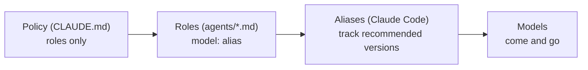

# pilotfish — Design Rationale

## Purpose

This document explains *why* pilotfish is shaped the way it is: three layers, role-based policy, aliases everywhere, effort tiers, and a verification gate. The empirical grounding (official docs, measured community numbers, subscription economics) lives in the [research report](./research.zh-TW.md); this is the argument from those facts to this design.

## The three layers

The core observation is that "who orchestrates", "who executes what", and "how delegation behaves" change at different rates and should therefore live in different places:

| Layer | File | Changes when | Mechanism |
|---|---|---|---|
| Machine | `~/.claude/settings.json` | Your plan/access changes | `model: "best"` + `fallbackModel` |
| Roles | `~/.claude/agents/*.md` | A model tier is re-pointed | One `model:` line of frontmatter per role |
| Policy | `~/.claude/CLAUDE.md` | Your working style changes | Prose rules written against role names |

CLAUDE.md cannot set the main-session model (that is a settings/`/model` concern), which turns out to be a feature: it forces the clean split where settings decide *who* orchestrates and CLAUDE.md decides *how* it delegates.

## Role-based policy, model-free prose

The single most important rule in pilotfish: **the policy text never names a model.** It says "delegate mechanical work to `mech-executor`", not "delegate to Sonnet". Model bindings exist in exactly one place — the frontmatter of each agent file.

This is what makes the fallback story degenerate into no-ops:

The June 2026 export-control suspension was a live test of this: accounts on aliases degraded gracefully — a notice banner, new sessions continuing on Opus — while users who had pinned the full `claude-fable-5` model ID got hard 404 errors. That is the fallback story working: `best` re-resolves, every role keeps its binding, and the policy text is already model-agnostic. The July 2026 subscription-to-credits boundary is expected to behave the same way per the documented resolution rule, though Anthropic has not published the exact boundary UX — worst case is one manual `/model` switch or enabling usage credits. The same holds for the next deprecation cycle (Opus 4.8 → 4.9, Sonnet 5 → next): aliases track the recommended version by design.

Three distinct failure modes get three distinct mechanisms — they are often conflated but shouldn't be:

| Failure | Mechanism | Layer |
|---|---|---|
| Lost *access* to the frontier model | `best` alias | settings |
| Model *overloaded / erroring* | `fallbackModel` chain | settings |
| Model *deprecated* | aliases in role frontmatter | agents |

## Why these eight roles

The role set is the smallest one that covers the delegation patterns that actually recur, mapped to the cheapest tier that reliably handles each:

| Role | Tier argument |
|---|---|
| `scout`, `Explore` | Reconnaissance is the highest-volume, lowest-judgment token sink in a coding session (telemetry showed ~36% of calls were exploration even before deliberate routing). For *locating* facts — not judging them — Haiku at low effort is effectively equivalent; judgment stays with the orchestrator. Both roles carry a positive `tools: Read, Glob, Grep` allowlist, so "read-only" is enforced, not just prompted. |
| `plan-verifier` | Material Plans benefit from fresh-context challenge before approval, but that phase cannot rely on a prompt-only no-write promise. Its positive `tools: Read, Glob, Grep` allowlist enforces the boundary while Opus supplies the judgment needed to return `READY` / `REVISE`. |
| `security-reviewer` | Pre-approval security evidence needs Opus-level judgment and an actually read-only surface. Its allowlist permits repository and external advisory reads while excluding Bash and every write-capable tool. |
| `mech-executor` | Fully-specified work has its judgment already done — by the orchestrator, in the spec. Sonnet executes specs faithfully, and on subscriptions it additionally draws on the dedicated Sonnet-only weekly bucket (extra headroom on top of the shared all-models limit). |
| `executor` | Real implementation needs local design judgment; Opus is the measured sweet spot below the frontier. Notably it beats routing to the frontier even ignoring cost, because routine work doesn't benefit from Fable-tier reasoning. |
| `verifier` | Official guidance: independent fresh-context verifiers outperform self-critique. After implementation it retains Bash to reproduce tests and returns `CONFIRMED` / `REFUTED`, while write tools stay disabled — a verifier that fixes work stops being independent. |
| `security-executor` | Approved security implementation deserves consistently high effort, and the frontier model's safety classifiers can refuse benign defensive-security work mid-task. Pre-routing it to Opus makes the refusal path unreachable instead of handled. It is intentionally separate from the read-only pre-approval reviewer. |

The `Explore` override exists because Claude Code v2.1.198 changed the built-in Explore agent to inherit the main-session model — on a frontier main session, that silently upgrades your cheapest workload to your most expensive model. A same-name user-level agent shadows it.

## Quality: verification over executor pedigree

The intuitive objection to cheap executors is quality. pilotfish's answer is structural, not hopeful:

1. The orchestrator writes complete one-shot Plans and execution specs (goal, constraints, done-criteria, the *why*) — most cheap-model failures are actually spec failures.
2. Material Plans can receive a tool-enforced read-only `plan-verifier` pass before approval; the main session still owns synthesis and revisions.
3. Escalation is bounded: two failed attempts on a tier, then escalate or take over. No infinite cheap retries that burn more than they save.
4. Non-trivial completed work passes through `verifier` — an adversarial, fresh-context pass that tries to *refute* the claimed outcome before the orchestrator reports it done.

Fresh verification isn't free — both verification roles run on Opus and re-read context in a fresh session. They are reserved for material Plans and non-trivial outcomes; small work skips them. What they buy is a change of question: from "does this look right to its author?" to "did it survive an independent refutation attempt?" Two known limits remain: same-tier verification catches context rot and unchecked claims, not capability-ceiling errors; and neither verifier certifies every scout fact. The main session must reconcile contradictory discovery and sanity-check load-bearing evidence. Security Plans use the dedicated read-only `security-reviewer`; security-sensitive outcomes make the outcome verifier probe abuse cases at maximum thoroughness.

## Phase-specific dispatch brakes

Role routing answers *which worker* should receive eligible work; it does not answer *what phase the task is in* or *whether spawning a worker is beneficial*. pilotfish therefore applies a different contract to discovery and execution instead of requiring a finished implementation outcome before any delegation.

| Phase | Stable before delegation | Main-session responsibility |
|---|---|---|
| Discovery | Question, allowed scope, evidence format, stop condition | Reconcile evidence and decide what it means |
| Plan | Evidence is sufficient to define outcome, non-goals, dependencies, ownership, sequence, verification, budgets, and stops | Synthesize one Plan and revise it after any readiness review |
| Approval | Material Plan is visible to the user | Wait for explicit approval before source writes or implementation briefs |
| Execution | Scope, exclusive ownership, constraints, done criteria, integration, verification | Integrate results and resolve architecture forks |
| Verification | Implementation is concrete enough to refute | Make the final judgment after independent evidence returns |

Within each phase's safety boundary, pilotfish chooses by net benefit across model cost, scarce context, elapsed time, isolation, and fresh independence versus reconstruction, coordination, integration, and verification cost. Delegation does not have to win every axis: a bounded cheap worker can be useful despite a small latency penalty.

A planning skill such as [Baton](https://github.com/cablate/baton) composes above this role layer. It may shape discovery questions, worker count, ownership, sequence, budgets, and stop conditions. pilotfish supplies the named Claude roles, model routing, leaf-agent boundary, approval gate, and verifier contract. Final Plan synthesis and judgment stay in the main session. The complete native-Claude lifecycle is captured in the [pilotfish + Baton compatibility gate](../benchmarks/baton-compatibility/README.md).

This distinction matters most during exploratory debugging. Runtime traces, root-cause hypotheses, patch anchors, and live verification often form one tightly coupled code path. Handing the middle of that chain to a fresh executor makes the executor rebuild context while the orchestrator waits, then makes the orchestrator rebuild enough context to integrate the answer. Such one-path work remains in the main session; one unknown bug must not become a sequential scout-to-executor pipeline. A large cross-surface investigation can still use bounded read-only discovery, but it returns to main-session Plan synthesis before execution.

A bounded task-local repository scan stays inline by default because worker startup and synthesis are real costs. Read-only discovery may still fan out when surfaces require substantial independent scanning, external or tool latency overlaps, or independently gathered evidence materially reduces Plan uncertainty. Directory boundaries alone do not decide the topology. Stable multi-file repetition remains a positive path to the cheap mechanical role, while fresh Plan and outcome verification retain independent quality boundaries.

Long-running process ownership follows the same closure rule. Every Bash-capable leaf role (`mech-executor`, `executor`, `verifier`, `security-executor`) runs bounded foreground commands and never detaches from harness tracking. If a command cannot finish within its 10-minute ceiling, it returns the exact command, absolute worktree or working directory, required environment, and input paths to the main orchestrator. The orchestrator owns tracked background execution in that exact context rather than the parent checkout, then re-tasks the leaf with the result. An agent likely to cross a command timeout must itself run in the background: a promoted command survives and notifies there, while the same command under a foreground-spawned agent is terminated after the agent returns.

## Effort tiers

Effort is the second big quota lever after model choice, and the Fable-5 generation shifted the calculus: low effort on current models routinely matches previous-generation `xhigh`. pilotfish therefore pairs every role with an effort:

| Role class | Effort | Why |
|---|---|---|
| Recon (`scout`, `Explore`) | `low` | High volume, near-zero judgment |
| Mechanical (`mech-executor`) | `low` | Judgment lives in the spec |
| Judgment (`executor`, `plan-verifier`, `verifier`) | `medium` | Balance point |
| Security (`security-reviewer`, `security-executor`) | `high` | Correctness over cost |
| Main session | `high` (user setting) | Official Fable 5 guidance: `high` for most work, `xhigh` for the longest horizons only |

## Deliberately left out

| Not included | Why |
|---|---|
| Per-project configuration | The six projects audited before building this had zero model policy in their CLAUDE.md files — correctly. A single global source of truth is the whole point; project files stay pure technical notes. |
| Enforcement hooks (spawn guards, stop guards à la fable5-orchestrator) | Powerful but heavy; policy-only works well before adding machinery. If discipline slips, hooks are the documented next step — see the research report. |
| `CLAUDE_CODE_SUBAGENT_MODEL` | It overrides every per-agent frontmatter globally, which is precisely the opposite of tiered routing. The installer warns if it's set. |
| Pinned model IDs | Pinning trades resilience for reproducibility; for a personal global config, resilience wins. Organizations that need pinning have `ANTHROPIC_DEFAULT_*_MODEL`. |
| An `opusplan` default | It's a great quota-saver but changes interactive feel (model switches mid-conversation). Offered as an opt-in in the FAQ instead. |

## Prompting style inside the agents

The agent system prompts follow the Fable-5-generation guidance from the research: goals and constraints instead of step-by-step scaffolding, an explicit statement of what *not* to do (no scope creep, verifier never fixes), evidence-audited progress claims, and "a precise *blocked because X* is a successful outcome" to prevent guessing. When editing the templates, keep that register — prescriptive checklists measurably degrade current-generation output.
